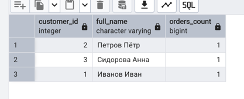
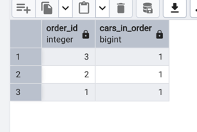
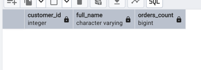
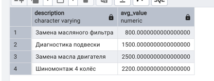
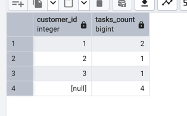
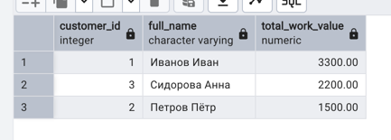

### COUNT, SUM, AVG, MIN, MAX, STRING_AGG

- Количество заказов у каждого клиента

```sql
SELECT c.id AS customer_id,
       c.full_name,
       COUNT(o.id) AS orders_count
FROM autoservice_schema.customer c
LEFT JOIN autoservice_schema."order" o ON o.customer_id = c.id
GROUP BY c.id, c.full_name;
```


- Количество машин в каждом заказе

```sql
SELECT oc.order_id,
       COUNT(oc.car_id) AS cars_in_order
FROM autoservice_schema.order_car oc
GROUP BY oc.order_id;
```


- Сумма стоимостей задач по каждому заказу

```sql
SELECT t.order_id,
       SUM(t.value) AS total_task_value
FROM autoservice_schema.task t
GROUP BY t.order_id;
```


- Средняя стоимость задачи (без типа работы — task_type отсутствует). Можно сгруппировать по полю description, если нужно:

```sql
SELECT t.description,
       AVG(t.value) AS avg_task_value
FROM autoservice_schema.task t
GROUP BY t.description;
```


- Минимальная и максимальная дата создания заказа по статусу — статус удален, поэтому этот запрос невозможен. Можно агрегировать только по creation_date:

```sql
SELECT
    MIN(o.creation_date) AS first_created,
    MAX(o.creation_date) AS last_created
FROM autoservice_schema."order" o;
```


- Список VIN всех машин в заказе одной строкой

```sql
SELECT oc.order_id,
       STRING_AGG(oc.car_id, ', ' ORDER BY oc.car_id) AS vin_list
FROM autoservice_schema.order_car oc
GROUP BY oc.order_id;
```


***

### GROUP BY, HAVING

- Клиенты с 3+ заказами

```sql
SELECT c.id AS customer_id,
       c.full_name,
       COUNT(o.id) AS orders_count
FROM autoservice_schema.customer c
JOIN autoservice_schema."order" o ON o.customer_id = c.id
GROUP BY c.id, c.full_name
HAVING COUNT(o.id) >= 3;
```


- Типы задач, где средняя стоимость > 500 — task_type нет, вместо этого можно использовать description:

```sql
SELECT t.description,
       AVG(t.value) AS avg_value
FROM autoservice_schema.task t
GROUP BY t.description
HAVING AVG(t.value) > 500;
```



***

### GROUPING SETS, ROLLUP, CUBE

- Кол-во задач по статусу заказа и по клиенту, плюс промежуточные и общий итоги — статус отсутствует, агрегируем только по клиенту:

```sql
SELECT
  o.customer_id,
  COUNT(t.id) AS tasks_count
FROM autoservice_schema."order" o
LEFT JOIN autoservice_schema.task t ON t.order_id = o.id
GROUP BY GROUPING SETS (
  (o.customer_id),
  ()
)
ORDER BY o.customer_id NULLS LAST;
```


- Иерархические итоги по филиалу → боксу → общему количеству машин (ROLLUP)

```sql
SELECT
  b.id_branch_office AS branch_id,
  b.id AS box_id,
  COUNT(ca.vin) AS cars_count
FROM autoservice_schema.box b
LEFT JOIN autoservice_schema.car ca ON ca.box_id = b.id
GROUP BY ROLLUP (b.id_branch_office, b.id)
ORDER BY branch_id NULLS LAST, box_id NULLS LAST;
```


- Полные комбинации количества заказов по клиенту (CUBE)

```sql
SELECT
  o.customer_id,
  COUNT(o.id) AS orders_count
FROM autoservice_schema."order" o
GROUP BY CUBE (o.customer_id)
ORDER BY o.customer_id NULLS LAST;
```


***

### SELECT, FROM, WHERE, GROUP BY, HAVING, ORDER BY

- Топ‑5 клиентов по сумме работ в их заказах за последний год

```sql
SELECT
  c.id AS customer_id,
  c.full_name,
  SUM(t.value) AS total_work_value
FROM autoservice_schema.customer c
JOIN autoservice_schema."order" o ON o.customer_id = c.id
JOIN autoservice_schema.task t ON t.order_id = o.id
WHERE o.creation_date >= NOW() - INTERVAL '1 year'
GROUP BY c.id, c.full_name
HAVING SUM(t.value) > 0
ORDER BY total_work_value DESC, c.full_name ASC
LIMIT 5;
```


- Среднее время выполнения заказа невозможно сгруппировать по статусу, так как статус убран. Можно вывести среднюю длительность для всех заказов:

```sql
SELECT
  AVG(EXTRACT(EPOCH FROM (ocd.closure_date - o.creation_date)) / 3600.0) AS avg_hours
FROM autoservice_schema."order" o
JOIN autoservice_schema.order_closure_date ocd ON o.id = ocd.order_id;
```
