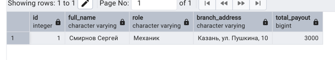
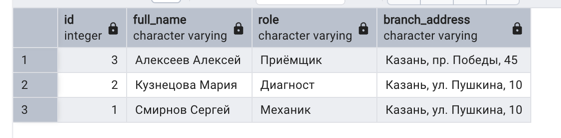
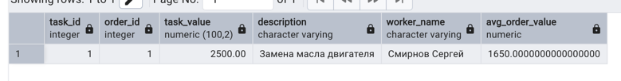
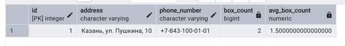
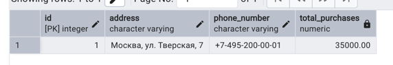

# Коррелированные подзапросы для базы данных Автосервиса

## 1. Работники с зарплатой выше средней по филиалу

```sql
SELECT 
    w.id,
    w.full_name,
    w.role,
    b.address AS branch_address,
    (
        SELECT SUM(p.value)
        FROM autoservice_schema.payout p
        WHERE p.worker_id = w.id
    ) AS total_payout
FROM autoservice_schema.worker w
INNER JOIN autoservice_schema.branch_office b ON w.id_branch_office = b.id
WHERE (
    SELECT SUM(p.value)
    FROM autoservice_schema.payout p
    WHERE p.worker_id = w.id
) > (
    SELECT AVG(total_payments)
    FROM (
        SELECT SUM(p2.value) AS total_payments
        FROM autoservice_schema.payout p2
        INNER JOIN autoservice_schema.worker w2 ON p2.worker_id = w2.id
        WHERE w2.id_branch_office = w.id_branch_office
        GROUP BY w2.id
    ) AS branch_avg
)
ORDER BY total_payout DESC;
```



## 2. NOT EXISTS - Работники без выплат

```sql
SELECT
    w.id,
    w.full_name,
    w.role,
    b.address AS branch_address
FROM autoservice_schema.worker w
         INNER JOIN autoservice_schema.branch_office b ON w.id_branch_office = b.id
WHERE EXISTS (
    SELECT 1
    FROM autoservice_schema.payout p
    WHERE p.worker_id = w.id
)
ORDER BY w.full_name;
```



## 3. Задачи с ценой выше средней по заказу

```sql
SELECT 
    t.id AS task_id,
    t.order_id,
    t.value AS task_value,
    t.description,
    w.full_name AS worker_name,
    (
        SELECT AVG(t2.value)
        FROM autoservice_schema.task t2
        WHERE t2.order_id = t.order_id
    ) AS avg_order_value
FROM autoservice_schema.task t
INNER JOIN autoservice_schema.worker w ON t.worker_id = w.id
WHERE t.value > (
    SELECT AVG(t2.value)
    FROM autoservice_schema.task t2
    WHERE t2.order_id = t.order_id
)
ORDER BY t.order_id, t.value DESC;
```



## 4. Филиалы с количеством боксов выше среднего

```sql
SELECT 
    b.id,
    b.address,
    b.phone_number,
    (
        SELECT COUNT(*)
        FROM autoservice_schema.box bx
        WHERE bx.id_branch_office = b.id
    ) AS box_count,
    (
        SELECT AVG(branch_boxes)
        FROM (
            SELECT COUNT(*) AS branch_boxes
            FROM autoservice_schema.box
            GROUP BY id_branch_office
        ) AS avg_boxes
    ) AS avg_box_count
FROM autoservice_schema.branch_office b
WHERE (
    SELECT COUNT(*)
    FROM autoservice_schema.box bx
    WHERE bx.id_branch_office = b.id
) > (
    SELECT AVG(branch_boxes)
    FROM (
        SELECT COUNT(*) AS branch_boxes
        FROM autoservice_schema.box
        GROUP BY id_branch_office
    ) AS avg_boxes
)
ORDER BY box_count DESC;
```



## 5. Поставщики с суммой закупок больше средней

```sql
SELECT 
    pr.id,
    pr.address,
    pr.phone_number,
    (
        SELECT COALESCE(SUM(pu.value), 0)
        FROM autoservice_schema.purchase pu
        WHERE pu.provider_id = pr.id
    ) AS total_purchases
FROM autoservice_schema.provider pr
WHERE (
    SELECT COALESCE(SUM(pu.value), 0)
    FROM autoservice_schema.purchase pu
    WHERE pu.provider_id = pr.id
) > (
    SELECT AVG(provider_total)
    FROM (
        SELECT COALESCE(SUM(pu2.value), 0) AS provider_total
        FROM autoservice_schema.purchase pu2
        GROUP BY pu2.provider_id
    ) AS avg_purchases
)
ORDER BY total_purchases DESC;
```
