## 1. CTE

### 1.1. Получить сколько заказов у Иванов 
```sql
WITH IVAN_CUSTOMERS AS (SELECT o.*
                        FROM autoservice_schema.customer JOIN autoservice_schema."order" o on customer.id = o.customer_id
                        WHERE full_name LIKE '% Иван')

SELECT customer_id, COUNT(*) as "orders count"
FROM IVAN_CUSTOMERS
GROUP BY customer_id;
```
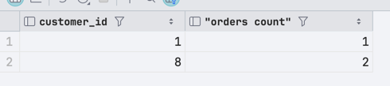


### 1.2. Сколько запчастей потратили на каждый заказ
```sql
WITH orders_tasks_autoparts AS (SELECT order_id, o.description
                                FROM autoservice_schema."order" o JOIN autoservice_schema.task t ON t.order_id = o.id
                                                                  JOIN autoservice_schema.autopart a ON a.task_id = t.id)

SELECT order_id, description, COUNT(*)
FROM orders_tasks_autoparts
GROUP BY order_id, description;
```
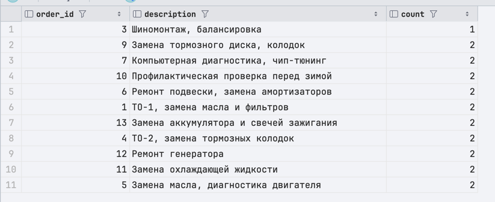


### 1.3 Найдите всех работников, которые выполнили более одной задачи. Для каждого такого работника выведите:
- ФИО работника
- Должность
- Количество выполненных задач
- Общую стоимость выполненных работ
```sql
with workers_tasks as (
    SELECT w.id, w.full_name, w.role, t.value
    FROM autoservice_schema.worker w
             JOIN autoservice_schema.task t on w.id = t.worker_id
)
select workers_tasks.full_name, workers_tasks.role, COUNT(workers_tasks.full_name) as count_of_tasks, SUM(workers_tasks.value) as sum_of_tasks from workers_tasks group by workers_tasks.full_name, workers_tasks.role;
```
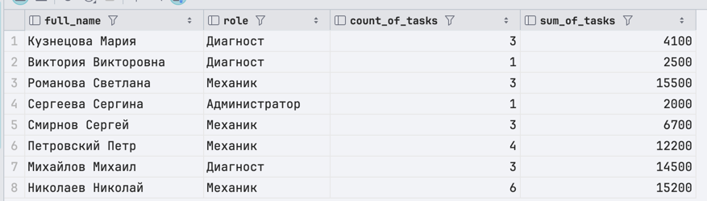


### 1.4 Выдать топ-2 работника по общему заработку по задачам
```sql
with order_stats as (
    SELECT o.id, c.full_name, COUNT(t.id) as count_of_tasks, SUM(t.value) as cost
    FROM autoservice_schema."order" o
    JOIN autoservice_schema.customer c on c.id = o.customer_id
    JOIN autoservice_schema.task t on o.id = t.order_id
    group by o.id, c.full_name
)
select order_stats.id as order_id, order_stats.full_name as customer_name, order_stats.count_of_tasks, order_stats.cost  from order_stats order by cost desc LIMIT 2;
```


### 1.5 Получить информации о работниках с количеством и суммой выполненных задач отсортированно
```sql
WITH worker_statistics AS (
    SELECT
        w.id,
        w.full_name,
        w.role,
        COUNT(t.id) as total_tasks,
        SUM(t.value) as total_value,
        AVG(t.value) as avg_task_value
    FROM autoservice_schema.worker w
             LEFT JOIN autoservice_schema.task t ON w.id = t.worker_id
    GROUP BY w.id, w.full_name, w.role
)

SELECT
    id,
    full_name,
    role,
    total_tasks,
    total_value,
    avg_task_value
FROM worker_statistics
ORDER BY total_tasks DESC, total_value DESC;
```
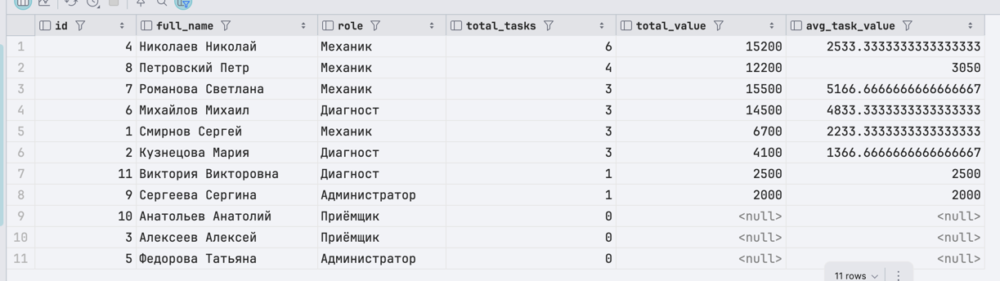


### 1.6 Иерархия филиалов, менеджеров и количество работников
```sql
WITH branch_info AS (
    SELECT
        bo.id,
        bo.address,
        bo.phone_number,
        COUNT(DISTINCT w.id) as worker_count,
        COUNT(DISTINCT bm.manager_id) as manager_count
    FROM autoservice_schema.branch_office bo
             LEFT JOIN autoservice_schema.worker w ON bo.id = w.id_branch_office
             LEFT JOIN autoservice_schema.branch_office_manager bm ON bo.id = bm.branch_office_id
    GROUP BY bo.id, bo.address, bo.phone_number
)
SELECT
    id,
    address,
    phone_number,
    worker_count,
    manager_count,
    CASE
        WHEN worker_count >= 3 THEN 'бОльшой филиал'
        WHEN worker_count >= 1 THEN 'Не большой филиал'
        ELSE 'Закрытый филиал'
        END as branch_status
FROM branch_info
ORDER BY worker_count DESC;
```
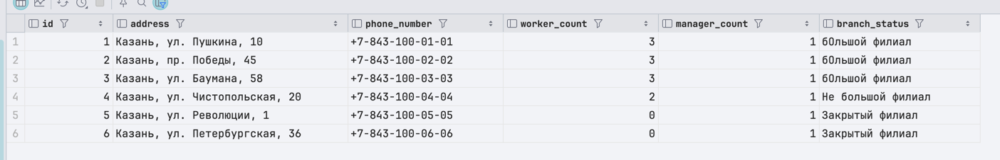


## 2. UNION, INTERSECT, EXCEPT


### 2.1. Получить сколько заказов у Иванов + Дмитриев + Петров (UNION)
```sql
WITH IVAN_CUSTOMERS AS (SELECT o.*
                        FROM autoservice_schema.customer JOIN autoservice_schema."order" o on customer.id = o.customer_id
                        WHERE full_name LIKE '% Иван'),
     DIMA_CUSTOMERS AS (SELECT o.*
                        FROM autoservice_schema.customer JOIN autoservice_schema."order" o on customer.id = o.customer_id
                        WHERE full_name LIKE '% Дмитрий'),
     PETR_CUSTOMERS AS (SELECT o.*
                        FROM autoservice_schema.customer JOIN autoservice_schema."order" o on customer.id = o.customer_id
                        WHERE full_name LIKE '% Пётр')

SELECT customer_id, COUNT(*) as "orders count"
FROM IVAN_CUSTOMERS
GROUP BY customer_id
UNION
SELECT customer_id, COUNT(*) as "orders count"
FROM DIMA_CUSTOMERS
GROUP BY customer_id
UNION
SELECT customer_id, COUNT(*) as "orders count"
FROM PETR_CUSTOMERS
GROUP BY customer_id;
```
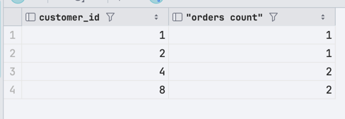


### 2.2. Сумма выплат работника должна быть больше 3500 и меньше 8000 (INTERSECT)
```sql
WITH MORE_THAN_3500_TOTAL_PAYOUTS AS (SELECT worker_id, SUM(value) as total
                                      FROM autoservice_schema.worker w JOIN autoservice_schema.payout p ON w.id = p.worker_id
                                      GROUP BY worker_id
                                      HAVING SUM(value) > 3500),
     LESS_THAN_8000_TOTAL_PAYOUTS AS (SELECT worker_id, SUM(value) as total
                                      FROM autoservice_schema.worker w JOIN autoservice_schema.payout p ON w.id = p.worker_id
                                      GROUP BY worker_id
                                      HAVING SUM(value) < 8000)

SELECT *
FROM MORE_THAN_3500_TOTAL_PAYOUTS
INTERSECT
SELECT *
FROM LESS_THAN_8000_TOTAL_PAYOUTS;
```
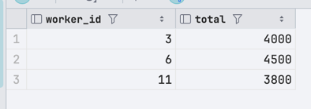

### 2.3. Выводим список клиентов с активными заказами (EXCEPT)
```sql
WITH ALL_USERS_WITH_ORDERS AS (SELECT w.full_name
                               FROM autoservice_schema.worker w JOIN autoservice_schema."order" o ON o.customer_id = w.id),
     USER_WITH_CLOSED_ORDERS AS (SELECT w.full_name
                                 FROM autoservice_schema.worker w JOIN autoservice_schema."order" o ON o.customer_id = w.id
                                                                  JOIN autoservice_schema.order_closure_date ocd ON ocd.order_id = o.id)

SELECT *
FROM ALL_USERS_WITH_ORDERS
EXCEPT
SELECT *
FROM USER_WITH_CLOSED_ORDERS;
```
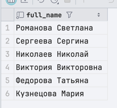

### 2.4 Выведите список всех людей в системе (и работников, и клиентов) с указанием их роли:
- Для работников: ФИО, телефон, роль (из колонки `role`)
- Для клиентов: ФИО, телефон, роль (статическое значение "Клиент")
```sql
select c.full_name, c.phone_number, 'Клиент' as role
from autoservice_schema.customer c
UNION
select w.full_name, w.phone_number, w.role
from autoservice_schema.worker w;
```
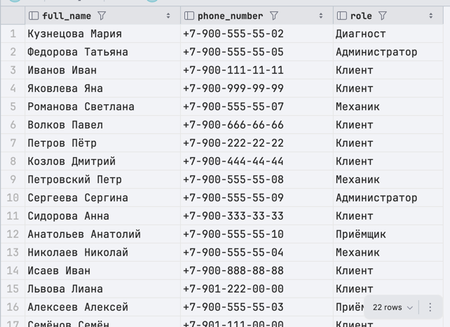


### 2.5 Найдите работников (по их ID), которые одновременно:
1. Выполняли задачи (есть запись в таблице task с их worker_id)
2. Получали выплаты (есть запись в таблице payout с их worker_id)
```sql
select t.worker_id
from autoservice_schema.task t
INTERSECT
select p.worker_id
from autoservice_schema.payout p;
```
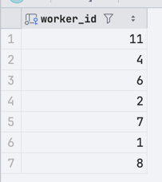


### 2.6 Найдите работников, которые когда-либо выполняли задачи, но НЕ получали выплат.
```sql
select t.worker_id
from autoservice_schema.task t
EXCEPT
select p.worker_id
from autoservice_schema.payout p;
```
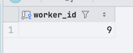


### 2.7 Объединение контактов клиентов и поставщиков, чтобы контакты были в одном отношении
```sql
SELECT
    'Клиент' as contact_type,
    id as contact_id,
    full_name as name,
    phone_number,
    NULL::text as address
FROM autoservice_schema.customer

UNION

SELECT
    'Поставщик' as contact_type,
    id as contact_id,
    'Поставщик ID ' || id::text as name,
    phone_number,
    address
FROM autoservice_schema.provider

ORDER BY contact_type DESC, contact_id;
```
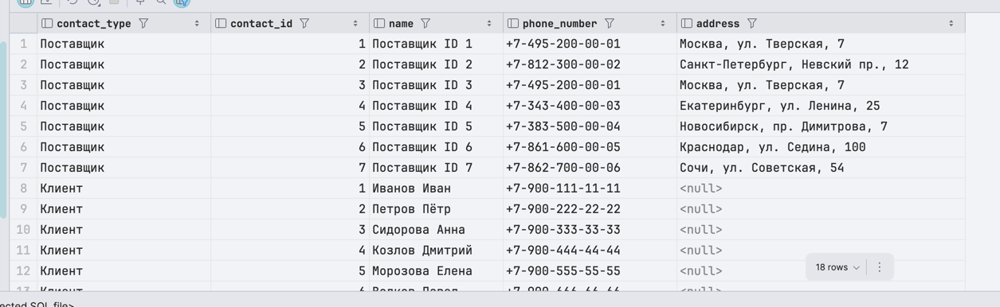


### 2.8 Найти клиентов, которые сделали заказы И имеют закрытые заказы
```sql
SELECT
    c.id,
    c.full_name,
    c.phone_number
FROM autoservice_schema.customer c
         JOIN autoservice_schema."order" o ON c.id = o.customer_id

INTERSECT

SELECT
    c.id,
    c.full_name,
    c.phone_number
FROM autoservice_schema.customer c
         JOIN autoservice_schema."order" o ON c.id = o.customer_id
WHERE o.id IN (SELECT order_id FROM autoservice_schema.order_closure_date);
```
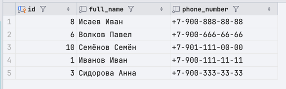


### 2.9 Найти клиентов, делавших заказы, но без закрытых заказов
```sql
SELECT
    c.id,
    c.full_name,
    c.phone_number
FROM autoservice_schema.customer c
         JOIN autoservice_schema."order" o ON c.id = o.customer_id

EXCEPT

SELECT
    c.id,
    c.full_name,
    c.phone_number
FROM autoservice_schema.customer c
         JOIN autoservice_schema."order" o ON c.id = o.customer_id
WHERE o.id IN (SELECT order_id FROM autoservice_schema.order_closure_date);
```
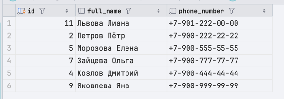


## 3. Оконные функции


### 3.1. Сколько в среднем получает работник какой-то роли (PARTITION BY)
```sql
SELECT DISTINCT w.role, AVG(p.value) OVER (PARTITION BY w.role) AS avg_payouts
FROM autoservice_schema.worker w JOIN autoservice_schema.payout p ON p.worker_id = w.id
```
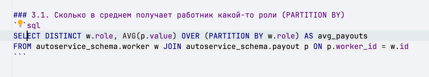


### 3.2. Сколько стоит каждая задача и сколько стоит весь заказ, которому принадлежит задача (PARTITION BY + ORDER)
```sql
WITH customer_order_task AS (SELECT full_name,  order_id, t.description, t.value
                             FROM autoservice_schema.customer c
                                      JOIN autoservice_schema."order" o on c.id = o.customer_id
                                      JOIN autoservice_schema.task t ON o.id = t.order_id)


SELECT full_name, order_id, description,
       value AS task_cost,
       sum(value) OVER (PARTITION BY order_id ORDER BY order_id) AS order_cost

FROM customer_order_task
```
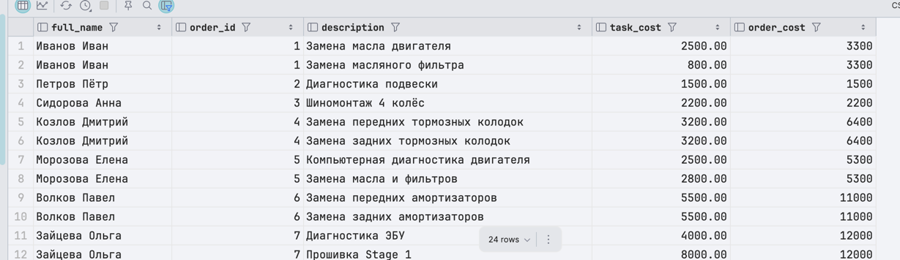

### 3.3. Задача + средняя стоимость трёх последних задач (ROWS RANGE)
```sql
SELECT t.description, t.value,
       avg(t.value) OVER (ORDER BY creation_date ROWS BETWEEN 2 PRECEDING AND CURRENT ROW)
FROM autoservice_schema.task t JOIN autoservice_schema."order" o on o.id = t.order_id
ORDER BY o.creation_date;
```
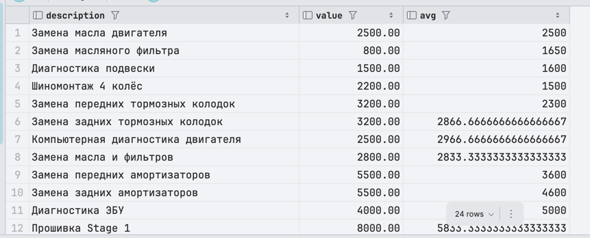


### 3.4. Топ работников по сумме выплат (RANK)
```sql
SELECT w.id, full_name, sum(value) AS total_payouts,  RANK() OVER (ORDER BY SUM(value) DESC) AS rank
FROM autoservice_schema.worker w JOIN autoservice_schema.payout p ON p.worker_id = w.id
group by full_name, w.id
```
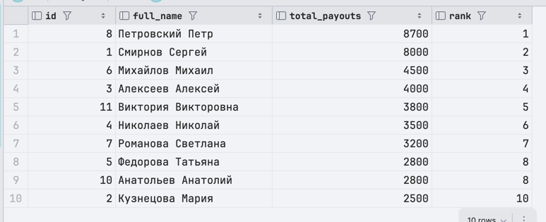


### 3.4. Задача + сумма трёх подряд идущих задач (LAG)
```sql
SELECT t.id, t.description, t.value, t.value + LAG(t.value, 1, 0) OVER (ORDER BY o.creation_date) + LAG(t.value, 2, 0) OVER (ORDER BY o.creation_date) AS last3
FROM autoservice_schema.task t JOIN autoservice_schema."order" o on o.id = t.order_id
ORDER BY o.creation_date;
```
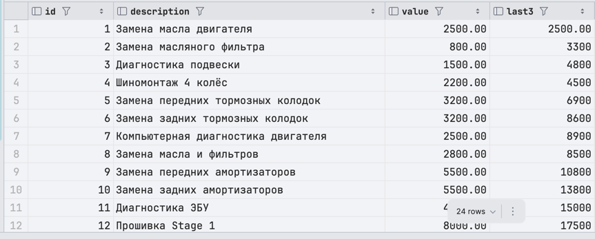

### 3.5. Показать, сколько дней прошло с первого заказа клиента до каждого его последующего заказа (FIRST_VALUE)
```sql
SELECT
    o.id as order_id,
    c.full_name,
    o.creation_date,
    t.value,
    FIRST_VALUE(o.creation_date) OVER (
        PARTITION BY c.id
        ORDER BY o.creation_date
        ) as first_order_date,
    o.creation_date - FIRST_VALUE(o.creation_date) OVER (
        PARTITION BY c.id
        ORDER BY o.creation_date
        ) as days_since_first_order
FROM autoservice_schema.customer c
         LEFT JOIN autoservice_schema."order" o ON c.id = o.customer_id
         LEFT JOIN autoservice_schema.task t ON o.id = t.order_id
ORDER BY c.id, o.creation_date;
```
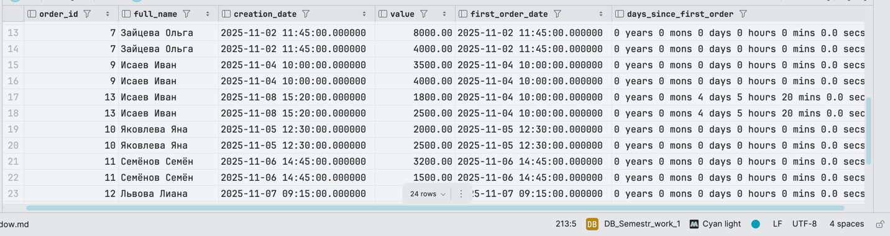


### 3.6 Для каждой задачи выведите:
- ID задачи
- Описание задачи
- Стоимость задачи
- ID заказа
- Среднюю стоимость всех задач по тому же заказу (используя PARTITION BY)
```sql
select t.id, t.description, t.value, t.order_id,
       AVG(t.value) OVER (PARTITION BY t.order_id) as avg_task_cost_in_order
from autoservice_schema.task t;
```


### 3.7 Для каждого заказа выведите список его задач в порядке возрастания стоимости. Для каждой задачи добавьте:
- Нарастающую сумму стоимостей (каждая следующая задача добавляет свою стоимость к предыдущей)
```sql
select o.id as order_id, t.id as task_id, t.value as task_value, SUM(t.value) OVER (PARTITION BY o.id ORDER BY t.value)
from autoservice_schema.task t
join autoservice_schema."order" o on o.id = t.order_id;
```
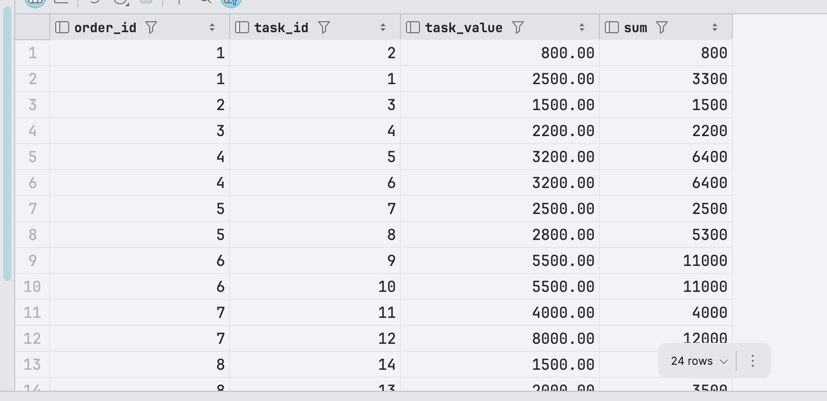


### 3.8 Проанализируйте историю выплат работникам. Для каждой выплаты покажите:
- ID выплаты
- ФИО работника
- Сумму этой выплаты
- Сумму этой выплаты + предыдущей выплаты этому работнику
```sql
select p.id as payout_id, w.full_name, p.value, SUM(p.value) over (partition by w.full_name order by p.date rows between 1 preceding and current row)
from autoservice_schema.payout p
join autoservice_schema.worker w on w.id = p.worker_id;
```
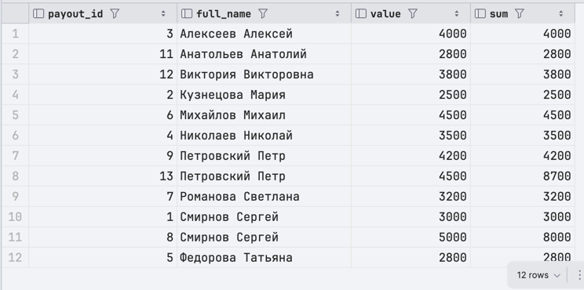


### 3.9 Создайте рейтинг работников по общей стоимости выполненных ими работ (sum of task.value). Выведите:
- Ранг работника (используя DENSE_RANK, так что одинаковые суммы получат одинаковый ранг)
- ФИО работника
- Общая стоимость его работ
```sql
with sum_of_tasks as (
    select task.worker_id as worker_id, SUM(task.value) as sum
    from autoservice_schema.task task GROUP BY task.worker_id
)
select sum_of_tasks.worker_id, w.full_name as worker_name, sum_of_tasks.sum, dense_rank() OVER(ORDER BY sum_of_tasks.sum DESC) as "dense"
from sum_of_tasks
join autoservice_schema.worker w on w.id = sum_of_tasks.worker_id order by dense;
```
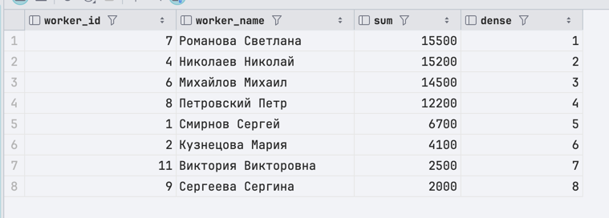


### 3.10 Для каждого заказа (в порядке создания по дате) покажите:
- ID текущего заказа
- Дату создания текущего заказа
- ФИО клиента текущего заказа
- Дату создания предыдущего заказа (если есть)
- ФИО клиента предыдущего заказа (если есть)
```sql
select "order".id as "current_order",
       "order".creation_date as "current_order_creation",
       c.full_name as "current_customer",
       Lag("order".creation_date) over (order by "order".creation_date) as prev_order_date,
       lag(c.full_name) over (order by "order".creation_date) as prev_order_customer
from autoservice_schema."order"
join autoservice_schema.customer c on c.id = "order".customer_id;
```
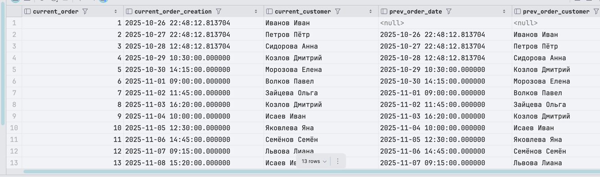


### PARTITION BY: Распределение задач по работникам с агрегацией
```sql
SELECT
    w.id,
    w.full_name,
    w.role,
    t.id as task_id,
    t.value,
    COUNT(*) OVER (PARTITION BY w.id) as tasks_per_worker,
    SUM(t.value) OVER (PARTITION BY w.id) as total_per_worker,
    MAX(t.value) OVER (PARTITION BY w.id) as max_task_value,
    ROUND(AVG(t.value) OVER (PARTITION BY w.id), 2) as avg_per_worker
FROM autoservice_schema.worker w
         LEFT JOIN autoservice_schema.task t ON w.id = t.worker_id;
```
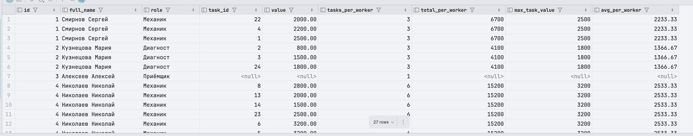


### PARTITION BY + ORDER BY: Кумулятивная сумма стоимости задач по работникам
```sql
SELECT
    w.id,
    w.full_name,
    t.id as task_id,
    t.value,
    SUM(t.value) OVER (
        PARTITION BY w.id
        ORDER BY t.id
        ) as cumulative_value
FROM autoservice_schema.worker w
         LEFT JOIN autoservice_schema.task t ON w.id = t.worker_id
WHERE t.id IS NOT NULL
ORDER BY w.id, t.id;
```


### ROWS: Средняя стоимость за последние 3 задачи
```sql
SELECT
    t.id,
    w.full_name,
    t.value,
    ROUND(AVG(t.value) OVER (
        ORDER BY t.id
        ROWS BETWEEN 2 PRECEDING AND CURRENT ROW
        ), 2) as avg_last_3_tasks,
    COUNT(*) OVER (
        ORDER BY t.id
        ROWS BETWEEN 2 PRECEDING AND CURRENT ROW
        ) as count_in_window
FROM autoservice_schema.task t
         JOIN autoservice_schema.worker w ON t.worker_id = w.id
ORDER BY t.id;
```
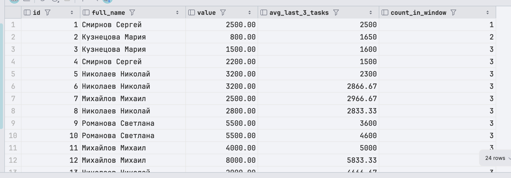


### RANGE: Сумма задач в диапазоне стоимости (±1500) от текушей
```sql
SELECT
    t.id,
    w.full_name,
    t.value,
    SUM(t.value) OVER (
        PARTITION BY w.id
        ORDER BY t.value
        RANGE BETWEEN 1500 PRECEDING AND 1500 FOLLOWING
        ) as sum_in_price_range,
    COUNT(*) OVER (
        PARTITION BY w.id
        ORDER BY t.value
        RANGE BETWEEN 1500 PRECEDING AND 1500 FOLLOWING
        ) as tasks_in_range
FROM autoservice_schema.task t
         JOIN autoservice_schema.worker w ON t.worker_id = w.id
ORDER BY w.id, t.value;
```
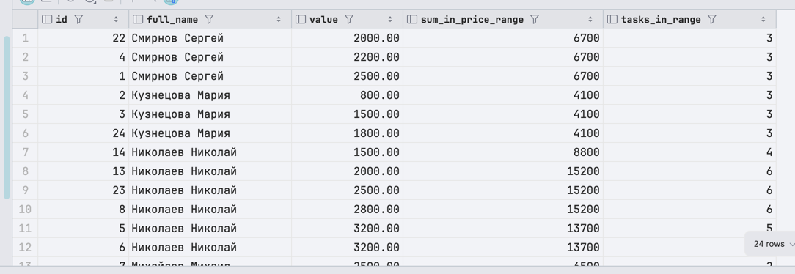


### ROW_NUMBER: Нумерация задач по работникам в порядке возрастания стоимости
```sql
SELECT
    w.id,
    w.full_name,
    t.id as task_id,
    t.value,
    ROW_NUMBER() OVER (
        PARTITION BY w.id
        ORDER BY t.value ASC
        ) as task_number
FROM autoservice_schema.task t
         JOIN autoservice_schema.worker w ON t.worker_id = w.id
ORDER BY w.id, task_number;
```
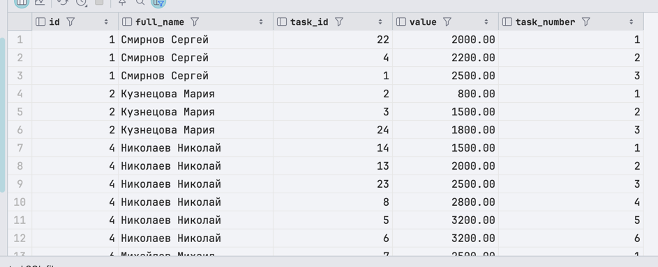

### LAST_VALUE: Получение последней стоимости задачи для каждого работника
```sql
SELECT
    w.id,
    w.full_name,
    t.id as task_id,
    t.value,
    LAST_VALUE(t.value) OVER (
        PARTITION BY w.id
        ORDER BY t.id
        ROWS BETWEEN UNBOUNDED PRECEDING AND UNBOUNDED FOLLOWING
        ) as last_task_value
FROM autoservice_schema.task t
         JOIN autoservice_schema.worker w ON t.worker_id = w.id
ORDER BY w.id, t.id;
```
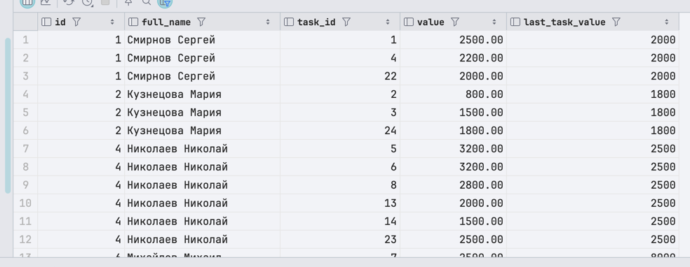