### Процедура для добавления нового клиента с проверкой телефона
```sql
-- Процедура для добавления нового клиента с проверкой телефона
CREATE OR REPLACE PROCEDURE autoservice_schema.add_new_customer(
    p_full_name VARCHAR,
    p_phone_number VARCHAR
)
LANGUAGE plpgsql
AS $$
BEGIN
    IF p_phone_number LIKE '+7%' THEN
        INSERT INTO autoservice_schema.customer (full_name, phone_number)
        VALUES (p_full_name, p_phone_number);
    END IF;
END;
$$;

CALL autoservice_schema.add_new_customer('Тестов Тест', '+7-901-123-45-67');
```

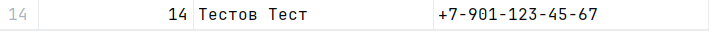

### Процедура добавления премии определенному сотруднику
```sql
CREATE OR REPLACE PROCEDURE assign_bonus (
   worker_id INT,
   bonus_value INT
)
LANGUAGE plpgsql
AS $$
    BEGIN
        INSERT INTO autoservice_schema.payout (value, date, payout_type, worker_id) VALUES (bonus_value, date(now()), 'Премия', assign_bonus.worker_id);
    end;
$$;

CALL assign_bonus(2, 10000);
```
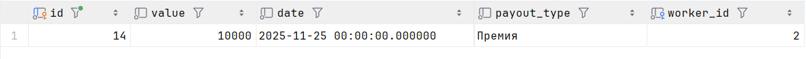

### Процедура регистрирует нового клиента
```sql
CREATE OR REPLACE PROCEDURE autoservice_schema.add_customer(
    full_name VARCHAR,
    phone_number VARCHAR
)
    LANGUAGE plpgsql
AS $$
BEGIN

    INSERT INTO autoservice_schema.customer (full_name, phone_number)
    VALUES (full_name, phone_number);

END;
$$;

CALL autoservice_schema.add_customer('Дарт Вейдер', '+666-666-6666');
```
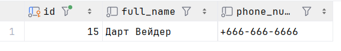

### Просмотр всех процедур в схеме autoservice_schema
```sql
-- Просмотр всех процедур в схеме autoservice_schema
SELECT routine_name, routine_type
FROM information_schema.routines
WHERE routine_type = 'PROCEDURE' AND routine_schema = 'autoservice_schema'
```

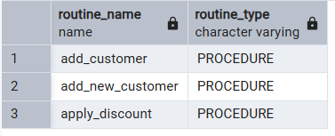

### Функция для подсчета общего количества задач для работника
```sql
-- Функция для подсчета общего количества задач для работника
CREATE OR REPLACE FUNCTION autoservice_schema.get_worker_tasks_count(
    p_worker_id INT
)
RETURNS INT
LANGUAGE plpgsql
AS $$
BEGIN
    RETURN (SELECT COUNT(*) FROM autoservice_schema.task
    WHERE worker_id = p_worker_id);
END;
$$;

SELECT autoservice_schema.get_worker_tasks_count(4);
```

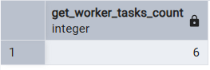

### Функция подсчета суммы всех задач определенного сотрудника
```sql
CREATE OR REPLACE FUNCTION calculate_tasks_values (
   w_id INT
)
RETURNS numeric(100, 2)
LANGUAGE sql
AS $$
   SELECT SUM(value)
    FROM autoservice_schema.task where worker_id = w_id ;
$$;


SELECT calculate_tasks_values(2);
```
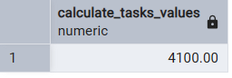

### Функция. Узнать есть ли клиент с таким номером телефона
```sql
CREATE OR REPLACE FUNCTION autoservice_schema.is_customer_phone_number(phone__number VARCHAR)
RETURNS BOOLEAN
LANGUAGE plpgsql
AS $$
    BEGIN
    RETURN (SELECT count(*)
            FROM autoservice_schema.customer
            WHERE phone_number = phone__number) >= 1;
    END;
$$;

SELECT autoservice_schema.is_customer_phone_number('+666-666-6666');
```
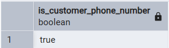

###  Функция c переменной для расчета средней стоимости задач для конкретного заказа
```sql
-- Функция для расчета средней стоимости задач для конкретного заказа
CREATE OR REPLACE FUNCTION autoservice_schema.calculate_order_avg_task_value(
    p_order_id INT
)
RETURNS DECIMAL(10, 2)
LANGUAGE plpgsql
AS $$
DECLARE
    avg_value DECIMAL(10, 2);
    total_value DECIMAL(10, 2);
    task_count INT;
BEGIN
    SELECT COALESCE(SUM(value), 0), COUNT(*)
    INTO total_value, task_count
    FROM autoservice_schema.task
    WHERE order_id = p_order_id;

    IF task_count > 0 THEN
        avg_value := total_value / task_count;
    ELSE
        avg_value := 0;
    END IF;

    RETURN avg_value;
END;
$$;

SELECT autoservice_schema.calculate_order_avg_task_value(1);
```

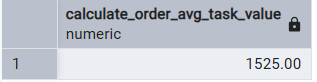

### Функция подсчета суммы всех задач определенного сотрудника c переменной
```sql
CREATE OR REPLACE FUNCTION calculate_tasks_values_with_var (
   w_id INT
)
RETURNS numeric(100, 2)
LANGUAGE plpgsql
AS $$
DECLARE total_sum numeric(100, 2);
    BEGIN 
   SELECT SUM(value) into total_sum
    FROM autoservice_schema.task where worker_id = w_id;
   RETURN total_sum;
    END;
$$;


SELECT calculate_tasks_values_with_var(2);
```
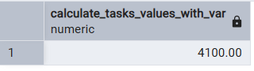

### Функция с переменной. Получить общую сумму выплат на сотрудника
```sql
CREATE OR REPLACE FUNCTION autoservice_schema.get_worker_payouts(worker__id INT)
    RETURNS INT
    LANGUAGE plpgsql
AS $$
DECLARE
    total_payouts INT;
BEGIN
    SELECT SUM(t.value) INTO total_payouts
    FROM autoservice_schema.worker w
             JOIN autoservice_schema.task t ON w.id = t.worker_id
    WHERE w.id = worker__id
    LIMIT 1;

    RETURN total_payouts;
END;
$$;

SELECT autoservice_schema.get_worker_payouts(4);
```
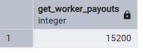

### Получение всех функций
```sql
SELECT routine_name, routine_type
FROM information_schema.routines
WHERE routine_type = 'FUNCTION' AND routine_schema = 'public'
```
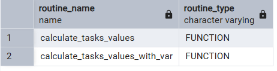

### Блок DO для обновления статуса автомобилей в конкретном боксе
```sql
-- Блок DO для обновления статуса автомобилей в конкретном боксе
DO $$
DECLARE
    updated_count INT;
BEGIN
    UPDATE autoservice_schema.car
    SET status = 'готово'
    WHERE box_id = 1 AND status != 'готово';

    GET DIAGNOSTICS updated_count = ROW_COUNT;

    RAISE NOTICE 'Обновлено автомобилей: %', updated_count;
END;
$$;
```

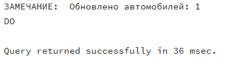

### DO. Проставить статус "Готово" машинам, у которых привязанный заказ завершен
```sql
DO
$$
    DECLARE
        vin_to_update text;
    BEGIN
        FOR vin_to_update in
            select vin
            from autoservice_schema.car
                     join autoservice_schema.order_car oc on car.vin = oc.car_id
                     join autoservice_schema.order_closure_date ocd on oc.order_id = ocd.order_id
            LOOP
                update autoservice_schema.car SET status='Готово' where vin = vin_to_update;
                RAISE NOTICE 'Машина с VIN % обновлена', vin_to_update;
            end loop;
    END;
$$
```
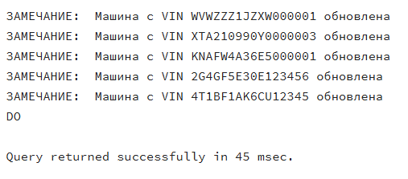

### Do. Добавляет владельца в базу данных
```sql
DO $$
BEGIN
    INSERT INTO autoservice_schema.worker(full_name, role, phone_number, id_branch_office)
    VALUES ('Скрудж Макдак', ' Владелец', '+7-777-777-77-77', 1);
END;
$$;
```
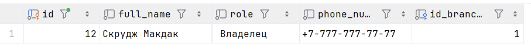

### If. Узнаёт дорогой ли заказ
```sql
CREATE OR REPLACE FUNCTION autoservice_schema.is_rich_order(order__id INT)
RETURNS VARCHAR
LANGUAGE plpgsql
AS $$
    DECLARE
        order_value INT;

    BEGIN
        SELECT SUM(value) INTO order_value
        FROM autoservice_schema."order"
            JOIN autoservice_schema.task t on "order".id = t.order_id
        WHERE order_id = order__id;


        IF order_value > 5000 THEN
            RETURN 'Дорогой';
        ELSE
            RETURN 'Дешёвый';
        end if;

    END;
$$;

SELECT autoservice_schema.is_rich_order(1);
```
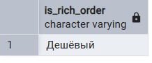

### Case
```sql
CREATE OR REPLACE FUNCTION autoservice_schema.is_rich_order_with_case(order__id INT)
    RETURNS VARCHAR
    LANGUAGE plpgsql
AS $$
DECLARE
    order_value INT;

BEGIN
    SELECT SUM(value) INTO order_value
    FROM autoservice_schema."order"
             JOIN autoservice_schema.task t on "order".id = t.order_id
    WHERE order_id = order__id;

    CASE
        WHEN order_value > 5000 THEN RETURN 'Дорогой';
        WHEN order_value > 4000 THEN RETURN 'Дороговитый';
        WHEN order_value > 3000 THEN RETURN 'Нормальный';
        WHEN order_value > 1000 THEN RETURN 'Дешевый';
        ELSE RETURN 'Копеечный';
    END CASE;

END;
$$;


SELECT autoservice_schema.is_rich_order_with_case(1);
```
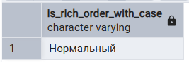

### WHILE. создать n заказчиков для теста
```sql
CREATE OR REPLACE PROCEDURE autoservice_schema.create_n_test_customers(count_customers INT)
LANGUAGE plpgsql
AS $$
    DECLARE
        i INT := 0;

    BEGIN
        WHILE i < count_customers LOOP
            CALL autoservice_schema.add_customer(concat('test', i), concat('+7-000-000-00-', i));
            i := i + 1;
        END LOOP;
    END;
$$;


CALL autoservice_schema.create_n_test_customers(3);
```
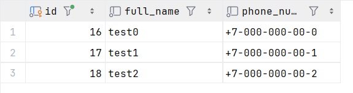

### While. напечатать n звездочек
```sql
CREATE OR REPLACE PROCEDURE autoservice_schema.print_stars(count_start INT)
LANGUAGE plpgsql
AS $$
    BEGIN

        WHILE count_start > 0 LOOP
            RAISE NOTICE '*';
            count_start := count_start - 1;
        END LOOP;

    END;
$$;

CALL autoservice_schema.print_stars(3);

```
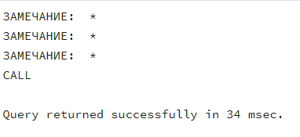

### EXCEPTION. Узнаем эффективность работника: разделить его выплаты на количество задач
```sql
DO
$$
   DECLARE
      sum_payouts numeric(100, 2);
      count_task  numeric(100, 2);
   BEGIN
      SELECT sum(value)
      into sum_payouts
      FROM autoservice_schema.payout
      where worker_id = 3;

      SELECT COUNT(*)
      into count_task
      FROM autoservice_schema.task
      where worker_id = 3;

      RAISE NOTICE 'Эффективность работника: %', sum_payouts / count_task;
   EXCEPTION
      WHEN division_by_zero THEN
         RAISE NOTICE 'Деление невозможно, у сотрудника 0 задач';

   END;
$$ 
```
Exception:
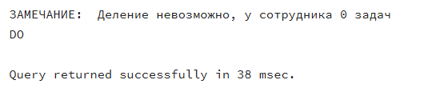
where worker_id = 1:
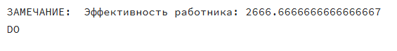

### EXCEPTION. Пытаемся вставить существующего работника
```sql
CREATE OR REPLACE PROCEDURE add_worker(
   worker_id INT,
   full_name varchar,
   role varchar,
   phone_number varchar,
   id_branch_office int
)
   LANGUAGE plpgsql
AS
$$
BEGIN
   INSERT INTO autoservice_schema.worker (id, full_name, role, phone_number, id_branch_office)
   VALUES (worker_id, add_worker.full_name, add_worker.role, add_worker.phone_number, add_worker.id_branch_office);
EXCEPTION
   WHEN unique_violation THEN RAISE NOTICE 'Работник с ID % уже существует!', worker_id;
end;
$$;

call add_worker(1, 'Тестовый', 'Механик', '89275438989', 4);
```
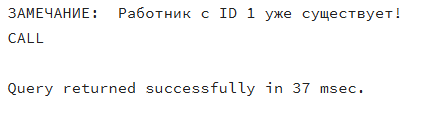

### RAISE 1: Функция с информационным сообщением RAISE NOTICE
```sql
-- RAISE 1: Функция с информационным сообщением RAISE NOTICE
CREATE OR REPLACE FUNCTION autoservice_schema.get_car_info(p_vin VARCHAR)
RETURNS TABLE(
    vin VARCHAR,
    model VARCHAR,
    plate_number VARCHAR,
    status VARCHAR
)
LANGUAGE plpgsql
AS $$
BEGIN
    RAISE NOTICE 'Запрос информации об автомобиле с VIN: %', p_vin;

    RETURN QUERY
    SELECT c.vin, c.model, c.plate_number, c.status
    FROM autoservice_schema.car c
    WHERE c.vin = p_vin;

    IF NOT FOUND THEN
        RAISE WARNING 'Автомобиль с VIN % не найден', p_vin;
    END IF;
END;
$$;

SELECT * FROM autoservice_schema.get_car_info('WVWZZZ1JZXW000002');
```

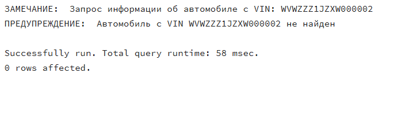

### RAISE 2: Применить скидку от клиента
```sql
-- RAISE 2: Применить скидку от клиента
CREATE OR REPLACE PROCEDURE autoservice_schema.apply_discount(
    p_task_id INT,
    p_discount_percent INT
)
LANGUAGE plpgsql
AS $$
BEGIN
    IF p_discount_percent < 0 OR p_discount_percent > 100 THEN
        RAISE EXCEPTION 'Скидка должна быть от 0 до 100 процентов, получено: %', p_discount_percent;
    END IF;
    
    UPDATE autoservice_schema.task
    SET value = value * (1 - p_discount_percent / 100.0)
    WHERE id = p_task_id;
    
    RAISE NOTICE 'Скидка % применена к задаче ID %', p_discount_percent, p_task_id;
END;
$$;

CALL autoservice_schema.apply_discount(1, 10);
CALL autoservice_schema.apply_discount(1, 150);
```

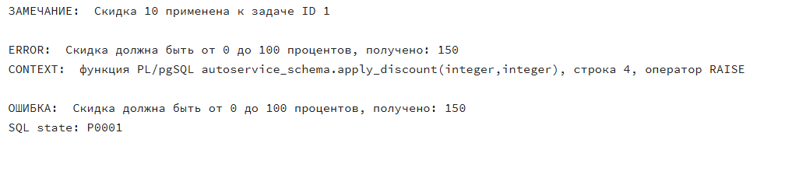