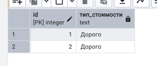
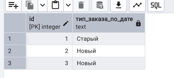
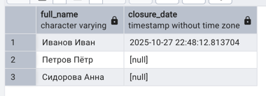
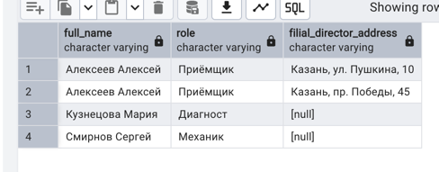
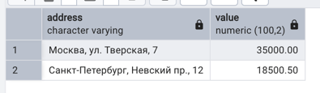
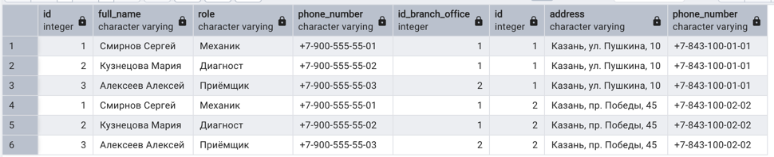
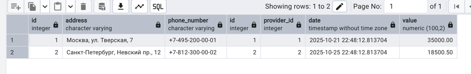

- Покупки: метка дорогая/дешевая
```sql
SELECT id, CASE WHEN value >= 1000 THEN 'Дорого' ELSE 'Дёшево' END AS тип_стоимости
FROM autoservice_schema.PURCHASE;
```


- Заказы: метка новый/старый
```sql
SELECT id, CASE WHEN creation_date >= '2025-10-27 22:48:12.813704' THEN 'Новый' ELSE 'Старый' END AS тип_заказа_по_дате
FROM autoservice_schema.ORDER;
```


- Сотрудники и выплаты
```sql
SELECT full_name, value
FROM autoservice_schema.worker INNER JOIN autoservice_schema.payout ON worker.id = payout.worker_id;
```


- Клиенты и статусы заказов
```sql
SELECT c.full_name, ocd.closure_date
FROM autoservice_schema.customer c
         JOIN autoservice_schema."order" o ON c.id = o.customer_id
         LEFT JOIN autoservice_schema.order_closure_date ocd ON o.id = ocd.order_id;
```


- Сотрудники и их филиалы
```sql
SELECT w.full_name, w.role, bo.address AS filial_director_address
FROM autoservice_schema.worker w
         LEFT JOIN autoservice_schema.branch_office_manager bom ON w.id = bom.manager_id
         LEFT JOIN autoservice_schema.branch_office bo ON bom.branch_office_id = bo.id;
```


- Поставщики и покупки
```sql
SELECT address, value
FROM autoservice_schema.provider LEFT JOIN autoservice_schema.purchase p on provider.id = p.provider_id;
```


- Авто и их задачи
```sql
SELECT car.plate_number, task.description, car.status
FROM autoservice_schema.task
         RIGHT JOIN autoservice_schema.car ON task.car_id = car.vin;
```


- Задачи и запчасти
```sql
SELECT task.order_id, task.description, autopart.name
FROM autoservice_schema.autopart
         RIGHT JOIN autoservice_schema.task ON autopart.task_id = task.id;
```


- Все пары сотрудник × филиал
```sql
SELECT *
FROM autoservice_schema.worker CROSS JOIN autoservice_schema.branch_office;
```


- Все пары поставщик × покупка
```sql
SELECT *
FROM autoservice_schema.provider CROSS JOIN autoservice_schema.purchase;
```


- Все сотрудники и филиалы
```sql
SELECT *
FROM autoservice_schema.worker w
         FULL OUTER JOIN autoservice_schema.branch_office_manager bom ON w.id = bom.manager_id
         FULL OUTER JOIN autoservice_schema.branch_office bo ON bom.branch_office_id = bo.id;
```


- Все поставщики и покупки
```sql
SELECT *
FROM autoservice_schema.provider full outer join autoservice_schema.purchase p on provider.id = p.provider_id;
```
