# часть 1

## 1. Транзакции

### 1.1. Базовая транзакция

Идейно:

- Регистрируем нового клиента
- Регистрируем его машину
- Создаём заказ
- Прикрепляем задачи к заказу

```sql
BEGIN;

WITH now_customer AS (
    INSERT INTO autoservice_schema.customer (full_name, phone_number)
        VALUES ('Паровозов Аркадий', '+7-800-555-35-35')
        RETURNING id),
     now_car AS (
         INSERT INTO autoservice_schema.car (vin, model, plate_number, status, box_id)
             SELECT upper(substr(md5(random()::text), 1, 17)) AS random_vin, ' Patriot', 'A001BC30', 'ожидает', 1
             RETURNING vin),
     now_order AS (
         INSERT INTO autoservice_schema."order" (customer_id, creation_date, description)
             SELECT c.id, '2025-11-18 10:00:00.000000', 'Полное ТО'
             FROM now_customer c
             RETURNING id),
     now_task1 AS (
         INSERT INTO autoservice_schema.task (order_id, value, worker_id, description, car_id)
             SELECT o.id, 2500, 8, 'Смена резины на зимнюю', c.vin
             FROM now_order o
                      CROSS JOIN now_car c),
     now_task2 AS (
         INSERT INTO autoservice_schema.task (order_id, value, worker_id, description, car_id)
             SELECT o.id, 5000, 11, 'Проверка АКБ и генератора', c.vin
             FROM now_order o
                      CROSS JOIN now_car c),
     now_task3 AS (
         INSERT INTO autoservice_schema.task (order_id, value, worker_id, description, car_id)
             SELECT o.id, 3000, 2, 'Компьютерная диагностика двигателя', c.vin
             FROM now_order o
                      CROSS JOIN now_car c)

SELECT *
FROM autoservice_schema.customer
LIMIT 1;

COMMIT;
```

### 1.2. Rollback транзакция

Просто поменяли COMMIT на ROLLBACK

```sql
BEGIN;

WITH now_customer AS (
    INSERT INTO autoservice_schema.customer (full_name, phone_number)
        VALUES ('Паровозов Аркадий', '+7-800-555-35-35')
        RETURNING id),
     now_car AS (
         INSERT INTO autoservice_schema.car (vin, model, plate_number, status, box_id)
             SELECT upper(substr(md5(random()::text), 1, 17)) AS random_vin, ' Patriot', 'A001BC30', 'ожидает', 1
             RETURNING vin),
     now_order AS (
         INSERT INTO autoservice_schema."order" (customer_id, creation_date, description)
             SELECT c.id, '2025-11-18 10:00:00.000000', 'Полное ТО'
             FROM now_customer c
             RETURNING id),
     now_task1 AS (
         INSERT INTO autoservice_schema.task (order_id, value, worker_id, description, car_id)
             SELECT o.id, 2500, 8, 'Смена резины на зимнюю', c.vin
             FROM now_order o
                      CROSS JOIN now_car c),
     now_task2 AS (
         INSERT INTO autoservice_schema.task (order_id, value, worker_id, description, car_id)
             SELECT o.id, 5000, 11, 'Проверка АКБ и генератора', c.vin
             FROM now_order o
                      CROSS JOIN now_car c),
     now_task3 AS (
         INSERT INTO autoservice_schema.task (order_id, value, worker_id, description, car_id)
             SELECT o.id, 3000, 2, 'Компьютерная диагностика двигателя', c.vin
             FROM now_order o
                      CROSS JOIN now_car c)

SELECT *
FROM autoservice_schema.customer
LIMIT 1;

ROLLBACK;
```

### 1.3. Ошибка в транзакции

Поменяли корректную дату заказа (2025-11-18 10:00:00.000000) на (-15454)

```sql
BEGIN;

WITH now_customer AS (
    INSERT INTO autoservice_schema.customer (full_name, phone_number)
        VALUES ('Паровозов Аркадий', '+7-800-555-35-35')
        RETURNING id),
     now_car AS (
         INSERT INTO autoservice_schema.car (vin, model, plate_number, status, box_id)
             SELECT upper(substr(md5(random()::text), 1, 17)) AS random_vin, ' Patriot', 'A001BC30', 'ожидает', 1
             RETURNING vin),
     now_order AS (
         INSERT INTO autoservice_schema."order" (customer_id, creation_date, description)
             SELECT c.id, '-15454', 'Полное ТО'
             FROM now_customer c
             RETURNING id),
     now_task1 AS (
         INSERT INTO autoservice_schema.task (order_id, value, worker_id, description, car_id)
             SELECT o.id, 2500, 8, 'Смена резины на зимнюю', c.vin
             FROM now_order o
                      CROSS JOIN now_car c),
     now_task2 AS (
         INSERT INTO autoservice_schema.task (order_id, value, worker_id, description, car_id)
             SELECT o.id, 5000, 11, 'Проверка АКБ и генератора', c.vin
             FROM now_order o
                      CROSS JOIN now_car c),
     now_task3 AS (
         INSERT INTO autoservice_schema.task (order_id, value, worker_id, description, car_id)
             SELECT o.id, 3000, 2, 'Компьютерная диагностика двигателя', c.vin
             FROM now_order o
                      CROSS JOIN now_car c)

SELECT *
FROM autoservice_schema.customer
LIMIT 1;

ROLLBACK;
```

## 2. Уровни изоляции

### 2.1. READ UNCOMMITTED, грязные данные

T1:
```sql
BEGIN TRANSACTION ISOLATION LEVEL READ UNCOMMITTED;

UPDATE autoservice_schema."order" SET description = 'Ремонт генератора/аккумулятора' WHERE "order".id = 12;

-- пока не делаем коммит
```

T2:
```sql
BEGIN TRANSACTION ISOLATION LEVEL READ UNCOMMITTED;

SELECT * FROM autoservice_schema."order" WHERE id = 12;
```

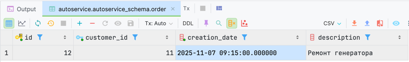


T1:
```sql
COMMIT;
```

T2:
```sql
SELECT * FROM autoservice_schema."order" WHERE id = 12;
```


Видим, что данные в T2 обновились только после COMMIT в T1, несмотря на выставленный уровень READ UNCOMMITTED
Вывод, postgres не разрешает READ UNCOMMITTED

### 2.2. READ COMMITTED, неповторяющееся чтение

T1:
```sql
BEGIN TRANSACTION ISOLATION LEVEL READ COMMITTED;

SELECT *
FROM autoservice_schema."order"
WHERE id = 12;
```


T2:
```sql
BEGIN TRANSACTION ISOLATION LEVEL READ COMMITTED;
UPDATE autoservice_schema."order" SET description = 'Ремонт аккумулятора' WHERE "order".id = 12;
COMMIT;
```

T1:
```sql
SELECT *
FROM autoservice_schema."order"
WHERE id = 12;
```


Если во время выполнения T1, другая транзакция изменит данные, то T1 будет использовать изменённые данные, что не всегда ожидаемо

### 2.3. REPEATABLE READ

#### T1 не видит изменений от T2, пока не завершится

T1:
```sql
BEGIN TRANSACTION ISOLATION LEVEL REPEATABLE READ;

SELECT *
FROM autoservice_schema."order"
WHERE id = 12;
```
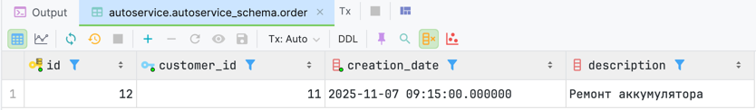

T2:
```sql
BEGIN;
UPDATE autoservice_schema."order" SET description = 'Ремонт шины' WHERE id = 12;
COMMIT;
```

T1:
```sql
SELECT * FROM autoservice_schema."order" WHERE id = 12;

COMMIT;
```


#### фантомное чтение через INSERT в T2

T1:
```sql
BEGIN;

SELECT *
FROM autoservice_schema.customer
WHERE id > 10;
```


T2:
```sql
BEGIN;
INSERT INTO autoservice_schema.customer (full_name, phone_number) VALUES ('Гарри Поттер', '+44 7700 900000');
COMMIT;
```

T1:
```sql
SELECT *
FROM autoservice_schema.customer
WHERE id > 10;

COMMIT;
```

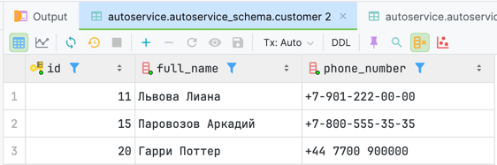

Можно сделать вывод, что в postgres при уровне REPEATABLE READ фантомное чтение невозможно, несмотря на таблицу
Для этого нужно понизить уровень изоляции до READ COMMITTED


### 2.4. SERIALIZABLE, ошибка could not serialize access due to concurrent update

T1:
```sql
BEGIN TRANSACTION ISOLATION LEVEL SERIALIZABLE;

UPDATE autoservice_schema.customer SET full_name = 'Паровозов Оркадий' WHERE id = 15;

-- запускаем T2
```

T2:
```sql
BEGIN TRANSACTION ISOLATION LEVEL SERIALIZABLE;

UPDATE autoservice_schema.customer SET full_name = 'Паровозов Олладий' WHERE id = 15;

COMMIT;
```

Здесь запрос не выполнялся, пока не дождался коммита на предыдущем


T1:
```sql
COMMIT;
```

Теперь выполнился T2 и вызвал ошибку could not serialize access due to concurrent update

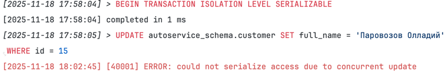

Повторим T2
```sql
ROLLBACK;
BEGIN TRANSACTION ISOLATION LEVEL SERIALIZABLE;

UPDATE autoservice_schema.customer SET full_name = 'Паровозов Олладий' WHERE id = 15;

COMMIT;
```
Успешно


## 3. SAVEPOINT

Изначально таблица выглядит так:


```sql
BEGIN;

SAVEPOINT before_update1;
UPDATE autoservice_schema.customer SET full_name = 'Паровозов Палладий' WHERE id = 15;

SAVEPOINT before_update2;
UPDATE autoservice_schema.customer SET full_name = 'Паровозов Палладий' WHERE id = 20;
SELECT *
FROM autoservice_schema.customer
WHERE id >= 15;
```


Откатываемся до первой точки сохранения
```sql
ROLLBACK TO before_update1;

SELECT *
FROM autoservice_schema.customer
WHERE id >= 15;
```

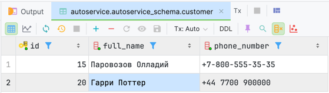

Откатываемся до второй сохранения
```sql
ROLLBACK TO before_update2;

SELECT *
FROM autoservice_schema.customer
WHERE id >= 15;
```

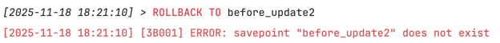

Ожидаемо ловим ошибку, так как, откатившивсь на первую точку сохранения бд уже не знает о существовании второй, объявленной позже

# часть 2

## Транзакции
### В систему добавляется новая закупка запчастей, и сразу же вносится одна конкретная запчасть, купленная в рамках этой закупки.
#### BEGIN ... COMMIT
```sql
BEGIN;
with purchase_id_cte as (
    insert into autoservice_schema.purchase (provider_id, date, value) VALUES (5, '2025-11-10 09:15:00.000000', 44000.0) returning id)
insert
into autoservice_schema.autopart (id, name, purchase_id, task_id)
select 31                as id,
       'Амортизатор BMW' as name,
       id                as purchase_id,
       null              as task_id
from purchase_id_cte;
commit;
```


#### BEGIN ... ROLLBACK
```sql
BEGIN;
with purchase_id_cte as (
    insert into autoservice_schema.purchase (provider_id, date, value) VALUES (4, '2025-12-10 09:15:00.000000', 22000.0) returning id)
insert
into autoservice_schema.autopart (id, name, purchase_id, task_id)
select 32                as id,
       'Руль audi' as name,
       id                as purchase_id,
       null              as task_id
from purchase_id_cte;
rollback;
```

#### Деление на ноль и откат
```sql
BEGIN;
with purchase_id_cte as (
    insert into autoservice_schema.purchase (provider_id, date, value) VALUES (4, '2025-12-10 09:15:00.000000', 22000.0) returning id)
insert
into autoservice_schema.autopart (id, name, purchase_id, task_id)
select 1 / 0       as id,
       'Руль audi' as name,
       id          as purchase_id,
       null        as task_id
from purchase_id_cte;
commit;
```

## Уровни изоляции

### Грязные данные. Ставим цену закупки без коммита и просматриваем в другом окне
Запрос в Т1
```sql
BEGIN TRANSACTION ISOLATION LEVEL READ UNCOMMITTED;
update autoservice_schema.purchase  SET value = 4000.0 where id = 3;
```

Запрос в Т2
```sql
BEGIN TRANSACTION ISOLATION LEVEL READ UNCOMMITTED;
select id, provider_id, date, value
from autoservice_schema.purchase where id = 3;
```


Запрос в Т1
```sql
COMMIT;
```

Запрос в Т2
```sql
select id, provider_id, date, value
from autoservice_schema.purchase where id = 3;
```
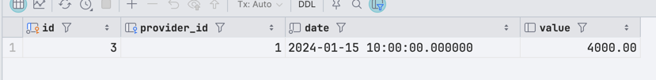


### Неповторяющееся чтение

Т1
```sql
BEGIN TRANSACTION ISOLATION LEVEL READ COMMITTED;
select id, provider_id, date, value
from autoservice_schema.purchase where id = 3;
```


T2
```sql
BEGIN TRANSACTION ISOLATION LEVEL READ COMMITTED;
update autoservice_schema.purchase  SET value = 5454000.0 where id = 3;
COMMIT;
```

T1
```sql
select id, provider_id, date, value
from autoservice_schema.purchase where id = 3;
COMMIT;
```


### Повторяющееся чтение (Т1 не видит изменения Т2, пока не завершится)

T1
```sql
BEGIN TRANSACTION ISOLATION LEVEL REPEATABLE READ;
select id, provider_id, date, value
from autoservice_schema.purchase where id = 3;
```
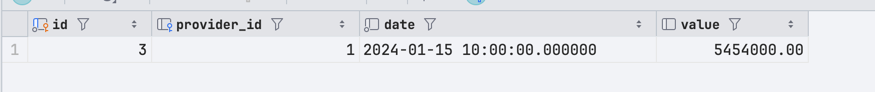

T2
```sql
BEGIN TRANSACTION ISOLATION LEVEL READ COMMITTED;
update autoservice_schema.purchase  SET value = 9000.0 where id = 3;
COMMIT;
```
T1
```sql
select id, provider_id, date, value
from autoservice_schema.purchase where id = 3;
COMMIT;
```


БД после Т1 и Т2


### Повторяющееся чтение (Фантомное чтение через INSERT)

T1
```sql
BEGIN TRANSACTION ISOLATION LEVEL REPEATABLE READ;
select id, provider_id, date, value
from autoservice_schema.purchase where value > 40000.0;
```


T2
```sql
BEGIN TRANSACTION ISOLATION LEVEL READ COMMITTED;
insert into autoservice_schema.purchase  (id, provider_id, date, value) VALUES (20, 4, '2024-07-22 09:45:00.000000', 41000.0);
COMMIT;
```

T1
```sql
select id, provider_id, date, value
from autoservice_schema.purchase where value > 40000.0;
```


### SERIALIZABLE - конфликт когда две транзакции вставляют одинаковые данные
T1
```sql
BEGIN TRANSACTION ISOLATION LEVEL SERIALIZABLE;
SELECT id, provider_id, date, value
FROM autoservice_schema.purchase where id = 3;
```
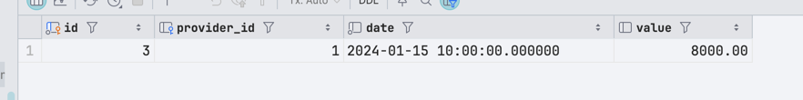

T2
```sql
BEGIN TRANSACTION ISOLATION LEVEL SERIALIZABLE;
SELECT id, provider_id, date, value
FROM autoservice_schema.purchase where id = 3;
```
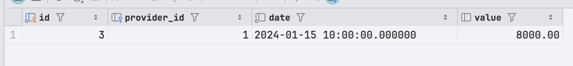

T1
```sql
UPDATE autoservice_schema.purchase SET value = value - 1000.0 where id = 3;
COMMIT;
```

T2
```sql
UPDATE autoservice_schema.purchase SET value = value - 1000.0 where id = 3;
```


T2
```sql
ROLLBACK;
BEGIN TRANSACTION ISOLATION LEVEL SERIALIZABLE;
UPDATE autoservice_schema.purchase SET value = value - 1000.0 where id = 3;
SELECT id, provider_id, date, value
FROM autoservice_schema.purchase where id = 3;
COMMIT;
```
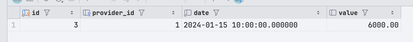

### Один SAVEPOINT
Создали закупку
Создали точку сохранения
Добавили 2 детали к этой закупке
Откатились к точке сохранения
Добавили еще деталь
Получилось, что в итоге в БД только одна деталь
T1
```sql
BEGIN;
insert into autoservice_schema.purchase  (id, provider_id, date, value) VALUES (23, 2, '2024-07-22 09:45:00.000000', 31000.0);
SAVEPOINT after_insert_purchase;
insert into autoservice_schema.autopart (id, name, purchase_id, task_id) VALUES (32, 'Name1', 23, null);
insert into autoservice_schema.autopart (id, name, purchase_id, task_id) VALUES (33, 'Name2', 23, null);
ROLLBACK TO SAVEPOINT after_insert_purchase;
insert into autoservice_schema.autopart (id, name, purchase_id, task_id) VALUES (34, 'Name3', 23, null);
COMMIT;
SELECT id, name, purchase_id, task_id
FROM autoservice_schema.autopart where purchase_id = 23;
```


### Два SAVEPOINT
```sql
BEGIN;
insert into autoservice_schema.purchase  (id, provider_id, date, value) VALUES (24, 2, '2024-07-22 09:45:00.000000', 31000.0);
SAVEPOINT after_insert_purchase;
insert into autoservice_schema.autopart (id, name, purchase_id, task_id) VALUES (35, 'Name1', 24, null);
SAVEPOINT after_insert_first_autopart;
insert into autoservice_schema.autopart (id, name, purchase_id, task_id) VALUES (36, 'Name2', 24, null);
insert into autoservice_schema.autopart (id, name, purchase_id, task_id) VALUES (37, 'Name3', 24, null);
ROLLBACK TO SAVEPOINT after_insert_first_autopart;
SELECT id, name, purchase_id, task_id
FROM autoservice_schema.autopart where purchase_id = 24;
ROLLBACK TO SAVEPOINT after_insert_purchase;
SELECT id, name, purchase_id, task_id
FROM autoservice_schema.autopart where purchase_id = 24;
COMMIT;
SELECT id, provider_id, date, value
FROM autoservice_schema.purchase where  id = 24;
```
Первый селект (после первого роллбека):

Мы видим, что осталось только деталь Name1, а добавление деталей Name2 и Name3 откатилось

Второй (после роллбека):

Мы видим что откатилось добавление всех деталей

Третий (после коммита)

Мы видим что хоть мы и делали откаты, но добавление закупки осталось после транзакции