## Триггеры

### NEW

#### Триггер на автозаполнение даты создания выплаты

```sql
CREATE OR REPLACE FUNCTION set_payout_time()
    RETURNS TRIGGER AS
$$
BEGIN
    IF NEW.date IS NULL THEN
        NEW.date := CURRENT_TIMESTAMP;
    END IF;

    RETURN NEW;
end;
$$ LANGUAGE plpgsql;

CREATE TRIGGER before_insert_payout
    BEFORE INSERT
    ON autoservice_schema.payout
    FOR EACH ROW
EXECUTE FUNCTION set_payout_time();
```
```sql
INSERT INTO autoservice_schema.payout (value, date, payout_type, worker_id)
VALUES (999, '2015-11-24 00:00:00.000000', 'Премия', 1);
INSERT INTO autoservice_schema.payout (value, payout_type, worker_id)
VALUES (999, 'Премия', 1);
```
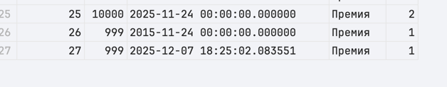

#### 1.1.1 если новая цена задачи меньше старой, то возвращаем старую
```sql
CREATE OR REPLACE FUNCTION autoservice_schema.defeat_lower_task_values()
    RETURNS TRIGGER
AS $$
BEGIN
    IF NEW.value < OLD.VALUE THEN
        RETURN OLD;
    ELSE
        RETURN NEW;
    end if;
END;
$$ LANGUAGE plpgsql;


CREATE TRIGGER defeat_task_values_trigger
    BEFORE UPDATE ON autoservice_schema.task
    FOR EACH ROW
EXECUTE FUNCTION autoservice_schema.defeat_lower_task_values();


SELECT id, value
FROM autoservice_schema.task
WHERE id = 26;

UPDATE autoservice_schema.task SET value = 1000 WHERE id = 26;

SELECT id, value
FROM autoservice_schema.task
WHERE id = 26;
```

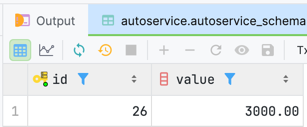


### OLD

#### 1.2.1
```sql
CREATE OR REPLACE FUNCTION autoservice_schema.defeat_task_values()
    RETURNS TRIGGER
AS $$
BEGIN
    RETURN OLD;
END;
$$ LANGUAGE plpgsql;


CREATE TRIGGER defeat_task_values_trigger
    BEFORE UPDATE ON autoservice_schema.task
    FOR EACH ROW
EXECUTE FUNCTION autoservice_schema.defeat_task_values();

SELECT id, value
FROM autoservice_schema.task
WHERE id = 24;

UPDATE autoservice_schema.task SET value = 200 WHERE id = 24;

SELECT id, value
FROM autoservice_schema.task
WHERE id = 24;
```

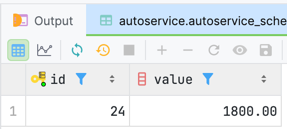

#### Триггер OLD. Блокировка изменения VIN

```sql
CREATE OR REPLACE FUNCTION autoservice_schema.prevent_vin_change_func()
RETURNS TRIGGER AS $$
BEGIN
    IF NEW.vin <> OLD.vin THEN
        RAISE EXCEPTION 'Изменение VIN-номера запрещено! Старый: %, Новый: %', OLD.vin, NEW.vin;
    END IF;
    RETURN NEW;
END;
$$ LANGUAGE plpgsql;

CREATE TRIGGER trg_prevent_vin_change
BEFORE UPDATE ON autoservice_schema.car
FOR EACH ROW
EXECUTE FUNCTION autoservice_schema.prevent_vin_change_func();

UPDATE autoservice_schema.car 
SET vin = 'NEW_FAKE_VIN_1234' 
WHERE vin = 'WVWZZZ1JZXW000001';
```
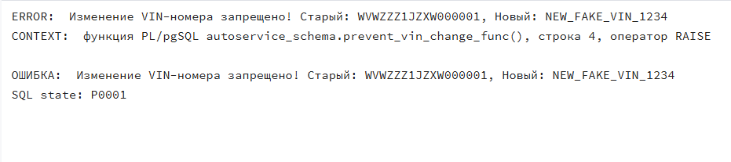

### BEFORE
#### 1.3.1 триггер ставит цену задачи 100, если она меньше
```sql
CREATE OR REPLACE FUNCTION autoservice_schema.defeat_insert_lower_than_min_value()
    RETURNS TRIGGER
AS $$
BEGIN
    IF NEW.value < 100 THEN
        NEW.value := 100;
    end if;
    RETURN NEW;
END;
$$ LANGUAGE plpgsql;


CREATE TRIGGER defeat_insert_lower_than_min_value
    BEFORE INSERT ON autoservice_schema.task
    FOR EACH ROW
    EXECUTE FUNCTION autoservice_schema.defeat_insert_lower_than_min_value();

INSERT INTO autoservice_schema.task (order_id, value, worker_id, description, car_id) VALUES (1, 10, 1, 'ура ура гол', 'XTA210990Y0000003');

SELECT order_id, value
FROM autoservice_schema.task
WHERE description = 'ура ура гол';
```
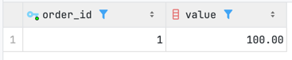


#### Триггер BEFORE. Коррекция отрицательной стоимости

```sql
CREATE OR REPLACE FUNCTION autoservice_schema.validate_task_value_func()
RETURNS TRIGGER AS $$
BEGIN
    IF NEW.value < 0 THEN
        RAISE NOTICE 'Отрицательная стоимость задачи (%) исправлена на 0', NEW.value;
        NEW.value := 0; 
    END IF;
    RETURN NEW;
END;
$$ LANGUAGE plpgsql;

CREATE TRIGGER trg_validate_task_value
BEFORE INSERT ON autoservice_schema.task
FOR EACH ROW
EXECUTE FUNCTION autoservice_schema.validate_task_value_func();

INSERT INTO autoservice_schema.task (order_id, value, worker_id, description, car_id)
VALUES (1, -5000.00, 1, 'Попытка ввода неверной цены', 'WVWZZZ1JZXW000001');

SELECT id, description, value 
FROM autoservice_schema.task 
WHERE description = 'Попытка ввода неверной цены'
ORDER BY id DESC LIMIT 1;
```

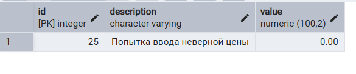


### AFTER

#### Триггер на логирование изменений статуса машины

```sql
CREATE OR REPLACE FUNCTION log_car_status_update()
    RETURNS TRIGGER AS
$$
BEGIN
    IF NEW.status IS DISTINCT FROM old.status THEN
        INSERT INTO autoservice_schema.car_status_log (vin, old_status, new_status, changed_at)
        VALUES (old.vin, old.status, new.status, CURRENT_TIMESTAMP);
    end if;
    RETURN new;
        
end;
$$ LANGUAGE plpgsql;

CREATE TRIGGER before_update_car_status
    BEFORE UPDATE
    ON autoservice_schema.car
    FOR EACH ROW
EXECUTE FUNCTION log_car_status_update();
```
```sql
UPDATE autoservice_schema.car SET status = 'В работе' where vin = '4T1BF1AK6CU12345';
```
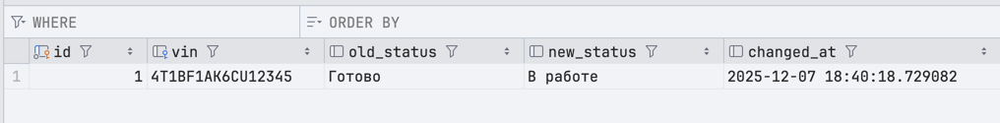


#### 1.4.1 триггер пишет в консоль при создании нового пользователя
```sql
CREATE OR REPLACE FUNCTION autoservice_schema.add_customer_logging()
RETURNS TRIGGER
AS $$
    BEGIN
        RAISE NOTICE 'Создали пользователя %', NEW.full_name;
        RETURN NEW;
    END;

$$ LANGUAGE plpgsql;


CREATE TRIGGER add_customer_logging
    AFTER INSERT ON autoservice_schema.customer
    FOR EACH ROW
    EXECUTE FUNCTION autoservice_schema.add_customer_logging();

INSERT INTO autoservice_schema.customer (full_name, phone_number) VALUES ('новый чел', '+599434');
```


### ROW LEVEL

#### Триггер на запрет удаления работника с задачами

```sql
CREATE OR REPLACE FUNCTION worker_delete_validation()
    RETURNS TRIGGER AS
$$
BEGIN
    
    IF EXISTS(SELECT 1 FROM autoservice_schema.task where worker_id = old.id) THEN
        RAISE EXCEPTION 'Нельзя удалить работника с активными задачами!';
    end if;
    RETURN old;
        
end;
$$ LANGUAGE plpgsql;

CREATE TRIGGER before_delete_worker
    BEFORE DELETE 
    ON autoservice_schema.worker
    FOR EACH ROW
EXECUTE FUNCTION worker_delete_validation();
```
```sql
DELETE FROM autoservice_schema.worker where id = 1;
```
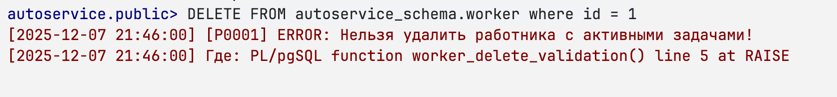
```sql
DELETE FROM autoservice_schema.worker where id = 12;
```


#### Триггер Row level. Автоматическое обновление статуса авто

```sql
CREATE OR REPLACE FUNCTION autoservice_schema.update_car_status_func()
RETURNS TRIGGER AS $$
BEGIN
    UPDATE autoservice_schema.car
    SET status = 'в работе'
    WHERE vin = NEW.car_id;

    RAISE NOTICE 'Статус автомобиля % изменен на "в работе"', NEW.car_id;
    RETURN NEW;
END;
$$ LANGUAGE plpgsql;

CREATE TRIGGER trg_update_car_status
AFTER INSERT ON autoservice_schema.task
FOR EACH ROW
EXECUTE FUNCTION autoservice_schema.update_car_status_func();

UPDATE autoservice_schema.car 
SET status = 'ожидает' 
WHERE vin = 'WBAAA31070B000002';

INSERT INTO autoservice_schema.task (order_id, value, worker_id, description, car_id)
VALUES (2, 1000.00, 2, 'Новая задача запускает ремонт', 'WBAAA31070B000002');

SELECT vin, model, status 
FROM autoservice_schema.car 
WHERE vin = 'WBAAA31070B000002';
```

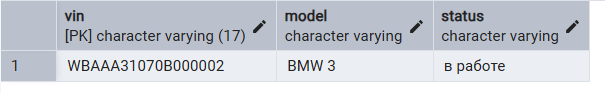


### STATEMENT LEVEL

#### Блок на стейтменты с выплатами ночью
```sql
CREATE OR REPLACE FUNCTION block_at_night_payout()
    RETURNS TRIGGER AS
$$
BEGIN
    
    IF TG_OP = 'INSERT' AND tg_level = 'STATEMENT' THEN
        IF CURRENT_TIME > '22:00:00.000000' OR CURRENT_TIME < '06:00:00.000000' THEN
            RAISE EXCEPTION 'Операции с выплатами запрещены в ночное время!';
        end if;
    end if;
    RETURN NULL;
        
end;
$$ LANGUAGE plpgsql;

CREATE TRIGGER block_at_night_payout_trigger
    BEFORE INSERT 
    ON autoservice_schema.payout
    FOR EACH STATEMENT 
EXECUTE FUNCTION block_at_night_payout();
```
```sql
INSERT INTO autoservice_schema.payout (value, payout_type, worker_id)
VALUES (999, 'Премия', 1);
```
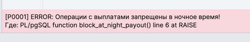


#### Триггер Statement level. Логирование массовых изменений

```sql
CREATE OR REPLACE FUNCTION autoservice_schema.audit_payout_update_func()
RETURNS TRIGGER AS $$
BEGIN
    RAISE NOTICE 'В таблице выплат (payout) произошли изменения (Statement Level Trigger)';
    RETURN NULL;
END;
$$ LANGUAGE plpgsql;

CREATE TRIGGER trg_audit_payout_stmt
AFTER UPDATE ON autoservice_schema.payout
FOR EACH STATEMENT
EXECUTE FUNCTION autoservice_schema.audit_payout_update_func();

UPDATE autoservice_schema.payout
SET value = value + 100
WHERE id IN (1, 2, 3);
```

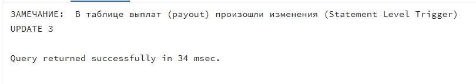


## Кроны

#### Очистка логов старше 30 дней каждый день в 3 утра
```sql
SELECT cron.schedule(
    'delete_old_logs',           
    '0 3 * * *',                 
     $$DELETE FROM autoservice_schema.car_status_log WHERE changed_at < NOW() - INTERVAL '30 days'$$
);
```
До:
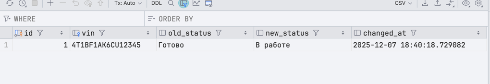
После
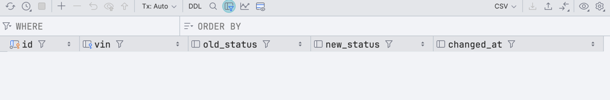

#### 2.1.1 каждую минуту/две меняет стоимость задачи

```sql
SELECT cron.schedule(
               'update_task27_value',
               '*/1 * * * *',
               'UPDATE autoservice_schema.task SET value = 10000 WHERE id = 27'
       );

SELECT cron.schedule(
               'update_task27_value2',
               '*/2 * * * *',
               'UPDATE autoservice_schema.task SET value = 5000 WHERE id = 27'
       );
```

#### Крон. Ежедневная очистка старых закупок

```sql
CREATE EXTENSION IF NOT EXISTS pg_cron;

SELECT cron.schedule(
    'clean_old_purchases',
    '0 3 * * *',
    $$DELETE FROM autoservice_schema.purchase WHERE date < now() - INTERVAL '5 years'$$
);

SELECT * FROM cron.job;
```


## Остальные

#### Запрос на просмотр кронов
```sql
SELECT 
    jobid,
    jobname,
    schedule,
    command,
    active
FROM cron.job
ORDER BY jobid;
```
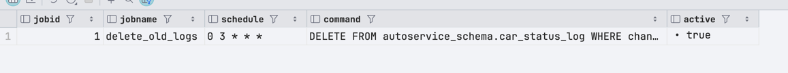


#### 2.2.1 запрос на просмотр выполнения кронов

```sql
SELECT * FROM cron.job_run_details;
```

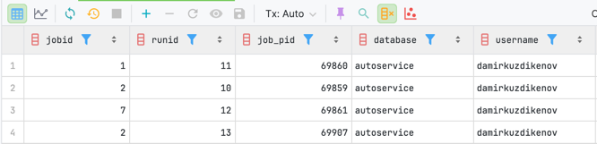
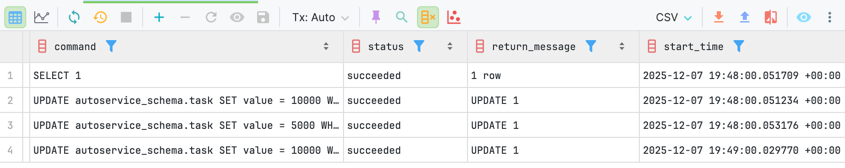


#### Отображение списка триггеров

```sql
SELECT * FROM information_schema.triggers
```

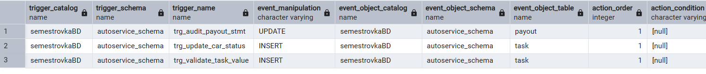