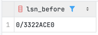
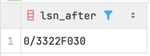
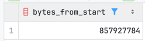
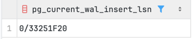
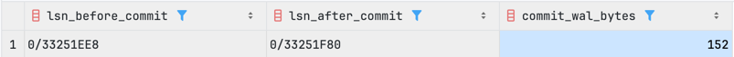
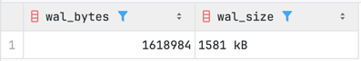
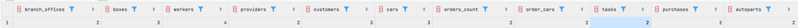

# дз на 17.03.2026

## Часть 1. Посмотреть на изменение LSN и WAL после изменения данных
### Сравнение LSN до и после INSERT

```sql
BEGIN;

SELECT pg_current_wal_insert_lsn() AS lsn_before;
```




```sql

INSERT INTO autoservice_schema.branch_office_manager(branch_office_id, manager_id) VALUES (3, 4);

SELECT pg_current_wal_insert_lsn() AS lsn_after;

SELECT pg_wal_lsn_diff(
               pg_current_wal_insert_lsn(),
               '0/0'::pg_lsn
       ) AS bytes_from_start;

ROLLBACK;
```






### Сравнение WAL до и после commit

```sql
CREATE TEMP TABLE IF NOT EXISTS wal_state (
                                              lsn_before_commit pg_lsn
) ON COMMIT PRESERVE ROWS;

TRUNCATE wal_state;

BEGIN;

INSERT INTO autoservice_schema.branch_office_manager(branch_office_id, manager_id) VALUES (3, 4);

INSERT INTO wal_state(lsn_before_commit)
SELECT pg_current_wal_insert_lsn();

COMMIT;
```



```sql
SELECT
    lsn_before_commit,
    pg_current_wal_insert_lsn() AS lsn_after_commit,
    pg_wal_lsn_diff(
            pg_current_wal_insert_lsn(),
            lsn_before_commit
    ) AS commit_wal_bytes
FROM wal_state;
```



### Анализ WAL размера после массовой операции

```sql
CREATE TEMP TABLE IF NOT EXISTS wal_state (
                                              lsn_before pg_lsn
) ON COMMIT PRESERVE ROWS;

TRUNCATE wal_state;

INSERT INTO wal_state
SELECT pg_current_wal_insert_lsn();

INSERT INTO autoservice_schema.provider (address, phone_number)
SELECT
    CASE WHEN random() < 0.2 THEN NULL ELSE 'Provider St. ' || i END,
    '+7' || (8000000000 + i)
FROM generate_series(1, 10000) AS i;

SELECT
    pg_wal_lsn_diff(pg_current_wal_insert_lsn(), lsn_before_commit) AS wal_bytes,
    pg_size_pretty(pg_wal_lsn_diff(pg_current_wal_insert_lsn(), lsn_before_commit)) AS wal_size
FROM wal_state;
```




## Часть 2. Сделать дамп БД и накатить его на новую чистую БД

### Dump структуры бд

Подключаемся к бд внутри докера и делаем дамп:
```
docker exec pg_autoservice pg_dump -U admin -d autoservice_db -s > schema_only.sql
```

Накатим дамп на новую бд
```
docker exec -it pg_autoservice createdb -U admin autoservice_db_clean

docker exec -i pg_autoservice psql -U admin -d autoservice_db_clean < schema_only.sql
```

Посмотрим есть ли данные
```
SELECT COUNT (*) FROM autoservice_schema.car;
 count 
-------
     0
(1 row)
```

### Dump одной таблицы

```
docker exec pg_autoservice pg_dump -U admin -d autoservice_db -a -t 'autoservice_schema.branch_office' > one_table.sql

docker exec -i pg_autoservice psql -U admin -d autoservice_db_clean < one_table.sql
```


```
SELECT COUNT(*) FROM autoservice_schema.branch_office;
 count  
--------
 250000
(1 row)
```

## Часть 3. Создать несколько seed

001_seed_reference.sql
Заполняет базовые справочники, от которых зависят остальные сущности: филиалы, боксы, сотрудники, менеджеры филиалов и поставщики.


002_seed_clients.sql
Файл добавляет клиентов и автомобили, которые затем используются в заказах и работах.

Для car используется конфликт по vin, потому что vin является первичным ключом таблицы

003_seed_orders.sql
Файл заполняет заказы, связь заказов с автомобилями, работы, закупки и запчасти.
В order_car используется составной первичный ключ (order_id, car_id), а в autopart есть ограничение уникальности на task_id.

Выполняем каждый скрипт
Проверяем таблицы
```sql
SELECT
        (SELECT COUNT(*) FROM autoservice_schema.branch_office) AS branch_offices,
        (SELECT COUNT(*) FROM autoservice_schema.box) AS boxes,
        (SELECT COUNT(*) FROM autoservice_schema.worker) AS workers,
        (SELECT COUNT(*) FROM autoservice_schema.provider) AS providers,
        (SELECT COUNT(*) FROM autoservice_schema.customer) AS customers,
        (SELECT COUNT(*) FROM autoservice_schema.car) AS cars,
        (SELECT COUNT(*) FROM autoservice_schema."order") AS orders_count,
        (SELECT COUNT(*) FROM autoservice_schema.order_car) AS order_cars,
        (SELECT COUNT(*) FROM autoservice_schema.task) AS tasks,
        (SELECT COUNT(*) FROM autoservice_schema.purchase) AS purchases,
        (SELECT COUNT(*) FROM autoservice_schema.autopart) AS autoparts;
```


При повторных запусках результат аналогичный