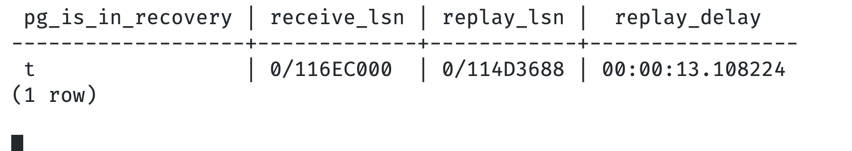
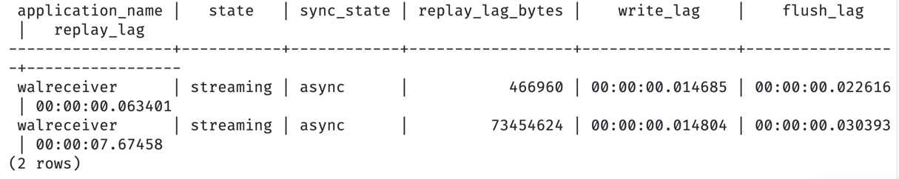

# дз на 25.03.2026

## Часть 1. Настроить потоковую репликацию

Сделал docker compose file

[docker-compose.yml](docker-compose.yml)

На primary запускается 
`CREATE ROLE replicator WITH REPLICATION LOGIN PASSWORD 'replpass';`

и устанавливается

[pg_hba.conf](primary/pg_hba.conf)

Реплики запускаются и выполняют
[bootstrap-replica.sh](replica/bootstrap-replica.sh)

Дожидается primary, если реплика еще пустая, то копируется primary целиком и настраивается standby
затем запускается как read-only реплика


## Часть 2. Проверка репликации данных

Вставляем данные на мастере
```
damirkuzdikenov@MacBook-Air-Damir-2 DB-semester-work % docker exec pg-primary psql -U postgres -c "CREATE DATABASE test_db;"
CREATE DATABASE
damirkuzdikenov@MacBook-Air-Damir-2 DB-semester-work % docker exec pg-primary psql -U postgres -c "CREATE TABLE users (id INT)"
CREATE TABLE
damirkuzdikenov@MacBook-Air-Damir-2 DB-semester-work % docker exec pg-primary psql -U postgres -c "INSERT INTO users (id) VALUES (2);"
INSERT 0 1
damirkuzdikenov@MacBook-Air-Damir-2 DB-semester-work % docker exec pg-primary psql -U postgres -c "SELECT * FROM users"            
 id 
----
  2
(1 row)
```


Смотрим на реплике
```
damirkuzdikenov@MacBook-Air-Damir-2 DB-semester-work % docker exec pg-replica-1 psql -U postgres -c "SELECT * FROM users"
 id 
----
  2
(1 row)
```


Попробуем вставить на реплике
```
damirkuzdikenov@MacBook-Air-Damir-2 DB-semester-work % docker exec pg-replica-1 psql -U postgres -c "INSERT INTO users (id) VALUES (3)"
ERROR:  cannot execute INSERT in a read-only transaction
```


## Часть 3. Анализ replication lag

На реплике добавили задержку применения WAL.

```
docker exec -it pg-replica-1 psql -U postgres -d postgres -c "ALTER SYSTEM SET recovery_min_apply_delay = '10s';"
docker exec -it pg-replica-1 psql -U postgres -d postgres -c "SELECT pg_reload_conf();"
docker exec -it pg-replica-1 psql -U postgres -d postgres -c "SHOW recovery_min_apply_delay;"
```

После этого на primary создавалась INSERT-нагрузка, а состояние репликации наблюдалось через `pg_stat_replication` на primary и через LSN-функции на standby.

```
while true; do
  clear
  docker exec pg-primary psql -U postgres -d test_db -c "
  SELECT
      application_name,
      state,
      sync_state,
      pg_wal_lsn_diff(pg_current_wal_lsn(), replay_lsn) AS replay_lag_bytes,
      write_lag,
      flush_lag,
      replay_lag
  FROM pg_stat_replication
  ORDER BY application_name;"
  sleep 1
done

```


```
while true; do
  clear
  docker exec pg-replica-1 psql -U postgres -d test_db -c "
  SELECT
      pg_is_in_recovery(),
      pg_last_wal_receive_lsn() AS receive_lsn,
      pg_last_wal_replay_lsn()  AS replay_lsn,
      CASE
          WHEN pg_last_xact_replay_timestamp() IS NULL THEN NULL
          ELSE now() - pg_last_xact_replay_timestamp()
      END AS replay_delay;"
  sleep 1
done

```

Нагрузка

```
for i in {1..20}; do
  docker exec pg-primary psql -U postgres -d test_db -c "
  INSERT INTO lag_test(payload)
  SELECT md5(random()::text)
  FROM generate_series(1, 50000);"
done
```

Во время эксперимента видно, что `pg-replica-1` получает WAL раньше, чем успевает его применить: `receive_lsn` больше `replay_lsn`, а `replay_delay` показывает временное отставание.
На primary это подтверждается ростом `replay_lag_bytes` и ненулевым `replay_lag` для одной из реплик.

потоковая репликация работает корректно, данные доставляются на standby, а искусственная задержка позволяет наглядно наблюдать replication lag в байтах и по времени.

### Скриншот 1. Состояние lag на standby



### Скриншот 2. Состояние pg_stat_replication на primary




## Часть 4. Настроить Logical replication

Настроил через docker compose в logical-replication
Сделали одинаковые таблицы в базах

```sql
CREATE TABLE IF NOT EXISTS test_pk (
                                       id int primary key,
                                       name text
);

CREATE TABLE IF NOT EXISTS test_nopk (
                                         id int,
                                         name text
);
```

в publisher 
`CREATE PUBLICATION pub_demo FOR TABLE test_pk, test_nopk;`


Подписываемся на publisher
```
docker exec -it pg-subscriber psql -U postgres -d test_db -c "
CREATE SUBSCRIPTION sub_demo
CONNECTION 'host=pg-publisher port=5432 dbname=test_db user=postgres password=postgres'
PUBLICATION pub_demo
WITH (copy_data = true);
"
```

### данные реплицируются

Проверка INSERT:

```
docker exec -it pg-publisher psql -U postgres -d test_db -c "
INSERT INTO test_pk VALUES (1, 'one'), (2, 'two');
"
bash
docker exec -it pg-subscriber psql -U postgres -d test_db -c "
SELECT * FROM test_pk ORDER BY id;
"
```
В одном сделали insert, в другом увидели изменения

### REPLICA IDENTITY

В таблице без primary key не получается сделать update
При этом insert/select работают
```
damirkuzdikenov@MacBook-Air-Damir-2 DB-semester-work % docker exec -it pg-publisher psql -U postgres -d test_db -c "
UPDATE test_nopk SET name = 'b' WHERE id = 1;
"

ERROR:  cannot update table "test_nopk" because it does not have a replica identity and publishes updates
HINT:  To enable updating the table, set REPLICA IDENTITY using ALTER TABLE.
```


Можно починить через REPLICA IDENTITY FULL
Но лучше использовать pk
```
damirkuzdikenov@MacBook-Air-Damir-2 DB-semester-work % docker exec -it pg-publisher psql -U postgres -d test_db -c "
ALTER TABLE test_nopk REPLICA IDENTITY FULL;
UPDATE test_nopk SET name = 'b' WHERE id = 1;
"

ALTER TABLE
UPDATE 1
damirkuzdikenov@MacBook-Air-Damir-2 DB-semester-work % docker exec -it pg-subscriber psql -U postgres -d test_db -c "
SELECT * FROM test_nopk;
"

 id | name 
----+------
  1 | b
(1 row)
```

### DDL не переносится

```

damirkuzdikenov@MacBook-Air-Damir-2 DB-semester-work % docker exec -it pg-publisher psql -U postgres -d test_db -c "
ALTER TABLE test_pk ADD COLUMN note text;
"

ALTER TABLE
damirkuzdikenov@MacBook-Air-Damir-2 DB-semester-work % docker exec -it pg-subscriber psql -U postgres -d test_db -c "\d test_pk"

              Table "public.test_pk"
 Column |  Type   | Collation | Nullable | Default 
--------+---------+-----------+----------+---------
 id     | integer |           | not null | 
 name   | text    |           |          | 
Indexes:
    "test_pk_pkey" PRIMARY KEY, btree (id)
```

Видно, что схема не поменялась.

### проверка replication status

```
docker exec -it pg-subscriber psql -U postgres -d test_db -c "
SELECT * FROM pg_stat_subscription;
"

 subid | subname  | pid | relid | received_lsn | last_msg_send_time | last_msg_receipt_time | latest_end_lsn | latest_end_time 
-------+----------+-----+-------+--------------+--------------------+-----------------------+----------------+-----------------
 16401 | sub_demo |     |       |              |                    |                       |                | 
(1 row)

(END)
```


```
damirkuzdikenov@MacBook-Air-Damir-2 DB-semester-work % docker exec -it pg-subscriber psql -U postgres -d test_db -c "
SELECT subname, subenabled, subslotname FROM pg_subscription;
"

 subname  | subenabled | subslotname 
----------+------------+-------------
 sub_demo | t          | sub_demo
(1 row)

damirkuzdikenov@MacBook-Air-Damir-2 DB-semester-work % docker exec -it pg-publisher psql -U postgres -d test_db -c "
SELECT slot_name, plugin, slot_type, active
FROM pg_replication_slots;
"

 slot_name |  plugin  | slot_type | active 
-----------+----------+-----------+--------
 sub_demo  | pgoutput | logical   | f
(1 row)
```

После рассинхрона active = false


### pg_dump и pg_restore

Они полезны для переноса схемы с мастера на подписчиков

```
pg_dump -h localhost -p 5432 -U postgres -d test_db --schema-only > schema.sql
psql -h localhost -p 5433 -U postgres -d test_db -f schema.sql
```
