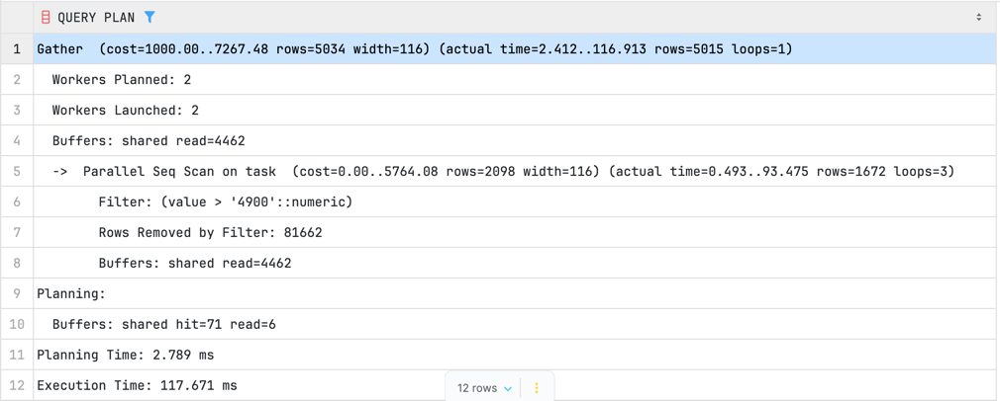
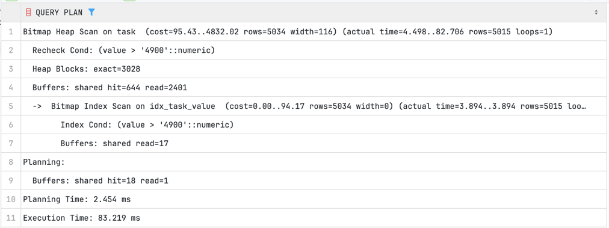
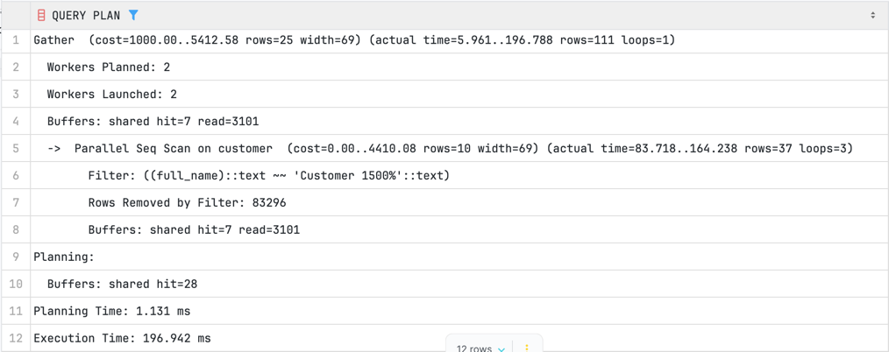
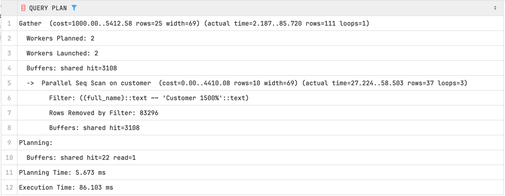
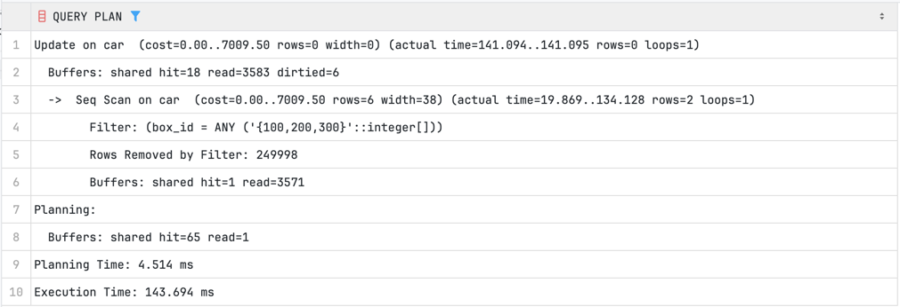
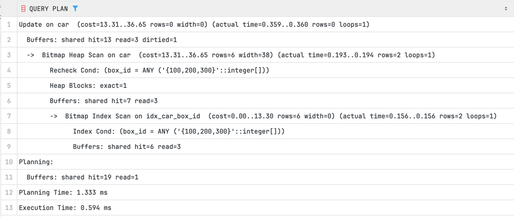
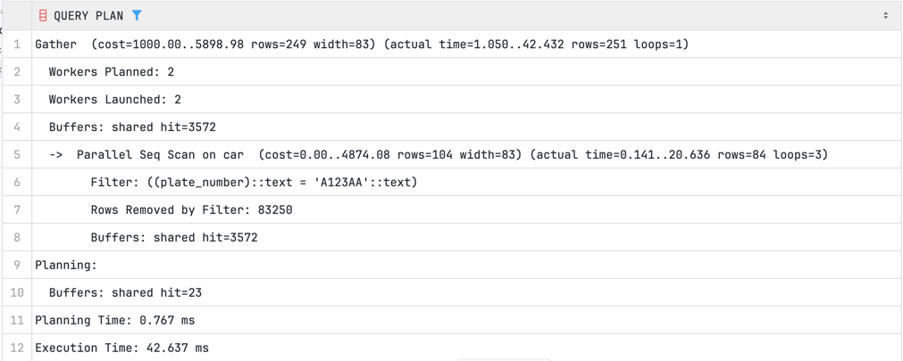
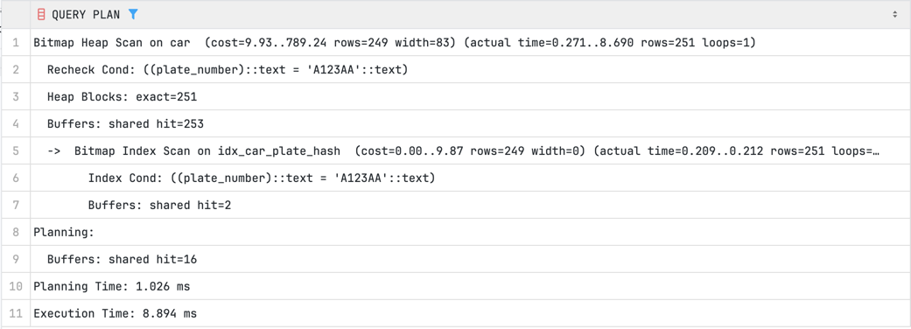
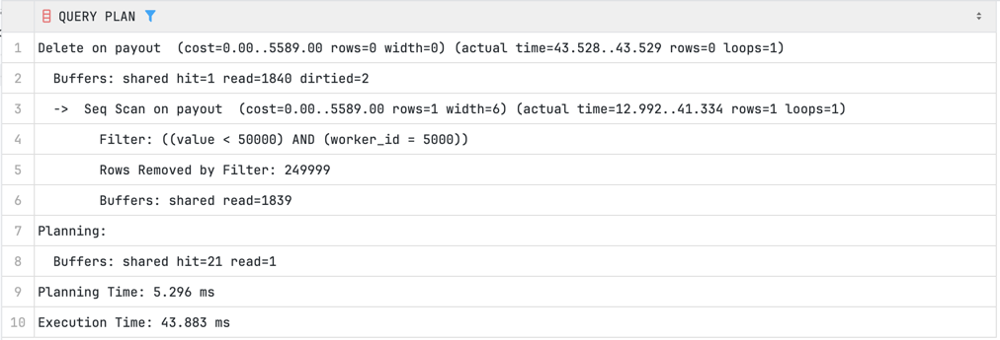
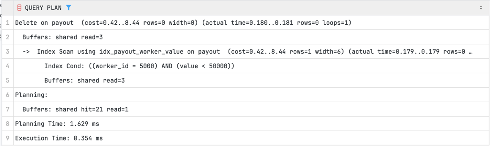

# дз на 04.03.2026
## 5 запросов на сканирование данных, описание результатов
### 1 запрос SELECT с оператором > (выборка дорогих задач)
```sql
EXPLAIN (ANALYZE, BUFFERS)
SELECT * FROM autoservice_schema.task
WHERE value > 4900;
```

#### Без индекса:


Заметим, что почти все строки были считаны с жесткого диска
Планировалось 2.8 ms, в реале 117.7 ms
Так как индекса нет, то запрос считал все строки из таблицы. Для ускорения он использовал parallel seq scan

#### C индексом:

```sql
CREATE INDEX idx_task_value ON autoservice_schema.task USING btree(value);
```




Планировалось 2.4 ms, в реале 83.2 ms
С индексом перешли на bitmap index scan

### 2 запрос SELECT с оператором LIKE % (поиск клиентов по префиксу имени)
```sql
EXPLAIN (ANALYZE, BUFFERS)
SELECT * FROM autoservice_schema.customer
WHERE full_name LIKE 'Customer 1500%';
```

#### Без индекса:



Заметим, что почти все строки были считаны с жесткого диска
Планировалось 1.1 ms, в реале 179.0 ms
Так как индекса нет, то запрос считал все строки из таблицы. Для ускорения он использовал parallel seq scan

#### С индексом

```sql
CREATE INDEX idx_customer_fullname ON autoservice_schema.customer USING btree(full_name);
```



Планировалось 5.7 ms, в реале 86.3 ms
Здесь мы так же использовали parallel seq scan. Индекс почти не дал ускорения, только за счёт кэширования в оперативке
Получается, что btree не так эффективен на строках. Лучше бы использовали gin

### 3 запрос UPDATE с оператором IN (обновление статуса машин в конкретных боксах)
```sql
EXPLAIN (ANALYZE, BUFFERS)
UPDATE autoservice_schema.car
SET status = 'Ready'
WHERE box_id IN (100, 200, 300);
```
#### Без индекса:


Заметим, что почти все строки были считаны с жесткого диска
Планировалось 4.5 ms, в реале 143.7 ms
Так как индекса нет, то запрос считал все строки из таблицы. Здесь использовался просто seq scan


#### С индексом

```sql
CREATE INDEX idx_car_box_id ON autoservice_schema.car USING btree(box_id);
```




Планировалось 1.3 ms, в реале 0.6 ms
С индексом перешли на bitmap index scan
Очень большое ускорение

### 4 запрос SELECT с оператором = (поиск машин по конкретному номеру, 250 тыс / 999 номеров = ~250 совпадений)
```sql
EXPLAIN (ANALYZE, BUFFERS)
SELECT * FROM autoservice_schema.car
WHERE plate_number = 'A123AA';
```

#### Без индекса:


Планировалось 0.8 ms, в реале 42.6 ms
Так как на предыдущем запросе уже считывали `autoservice_schema.car`, то тут все строки были уже в оперативке.
Использовался parallel seq scan


#### С индексом

```sql
CREATE INDEX idx_car_plate_hash ON autoservice_schema.car USING hash(plate_number);
```



Планировалось 1.0 ms, в реале 8.9 ms
С индексом перешли на bitmap index scan
Много считали из оперативки

### 5 запрос DELETE с комбинацией = и < (удаление выплат конкретному работнику, если сумма меньше 50000)
```sql
EXPLAIN (ANALYZE, BUFFERS)
DELETE FROM autoservice_schema.payout
WHERE worker_id = 5000 AND value < 50000;
```

#### Без индекса:



Планировалось 16.3 ms, в реале 43.9 ms
Использовался seq scan
Этот запрос на DELETE, поэтому он так же будет влиять на будущий этот же запрос, но с индексом

#### С индексом

```sql
CREATE INDEX idx_payout_worker_value ON autoservice_schema.payout (worker_id, value);
```




Планировалось 1.6 ms, в реале 0.3 ms
Использовался index scan
Очевидно, что все строки уже были удалены, поэтому запрос выполнился очень быстро


