# дз на 11.03.2026

## Часть 1. 5 запросов с использованием GIN (создание, сканирование, сравнение)
### 1 запрос GIN на массив (поиск клиентов с тегом 'vip')
```sql
EXPLAIN (ANALYZE, BUFFERS)
SELECT * FROM autoservice_schema.customer 
WHERE tags @> ARRAY['vip'];
```
#### Без индекса:
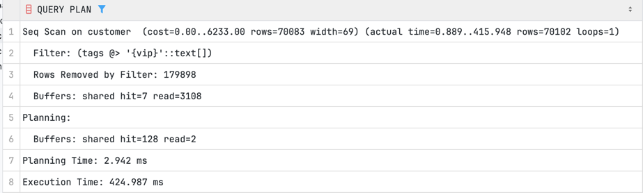

Заметим, что использовался `Seq Scan`
Планировалось ~2.9 ms, в реале ~425.0 ms.

#### С индексом GIN:
```sql
CREATE INDEX idx_customer_tags_gin ON autoservice_schema.customer USING gin(tags);
```
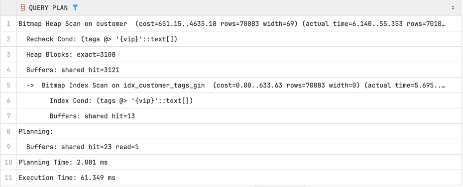

С индексом перешли на `Bitmap Index Scan`. GIN мгновенно нашел нужные ID строк
Время выполнения упало до ~61.3 ms. Огромное ускорение на массивах.

### 2 запрос GIN на пересечение массивов (клиенты с тегами 'corp' ИЛИ 'vip')
```sql
EXPLAIN (ANALYZE, BUFFERS)
SELECT * FROM autoservice_schema.customer
WHERE tags && ARRAY['corp', 'vip'];
```
#### С индексом GIN:
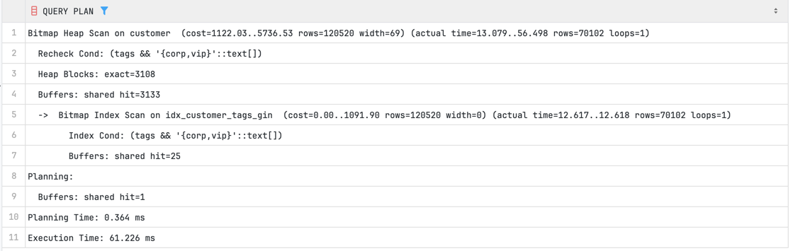

Использовался `Bitmap Heap Scan`. Запрос выполнился за ~61.2 ms.

### 3 запрос GIN на JSONB (поиск машин с двигателем V9)
```sql
EXPLAIN (ANALYZE, BUFFERS)
SELECT * FROM autoservice_schema.car 
WHERE specs @> '{"engine": "V9"}';
```
#### Без индекса:
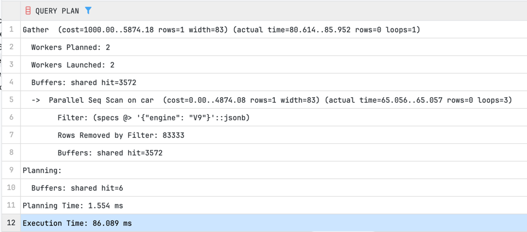

Использовался `Parallel Seq Scan`. В реале заняло ~86 ms.

#### С индексом GIN:
```sql
CREATE INDEX idx_car_specs_gin ON autoservice_schema.car USING gin(specs);
```
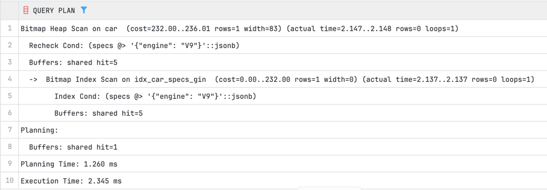

Использовался `Bitmap Index Scan`. GIN распаковал ключи JSONB в инвертированный индекс. Время упало до ~2.3 ms.

### 4 запрос GIN на проверку ключа в JSONB (все машины, у которых указана модель)
```sql
EXPLAIN (ANALYZE, BUFFERS)
SELECT * FROM autoservice_schema.car
WHERE specs ? 'color' AND specs ? 'model';
```
#### С индексом GIN:


Быстрое чтение из кэша, выполнение ~1.8 ms.

### 5 запрос GIN на полнотекстовый поиск (поиск задач по слову 'model')
```sql
EXPLAIN (ANALYZE, BUFFERS)
SELECT * FROM autoservice_schema.task
WHERE description_search @@ to_tsquery('english', 'model');
```
#### Без индекса:
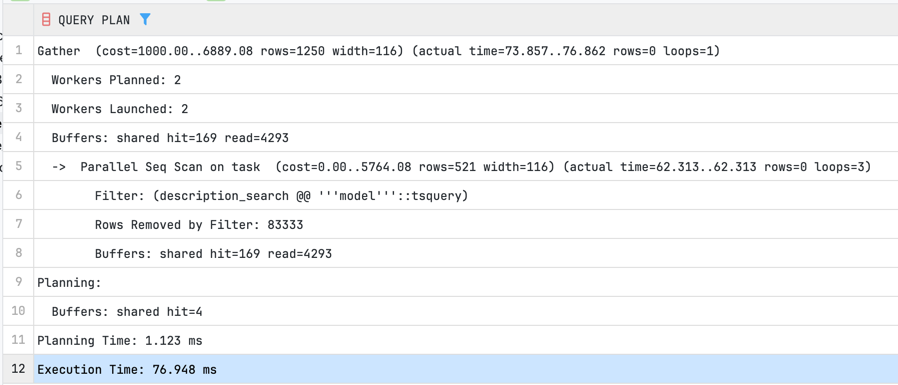

`Parallel Seq Scan` занял около ~77 ms

#### С индексом GIN:
```sql
CREATE INDEX idx_task_tsvector_gin ON autoservice_schema.task USING gin(description_search);
```
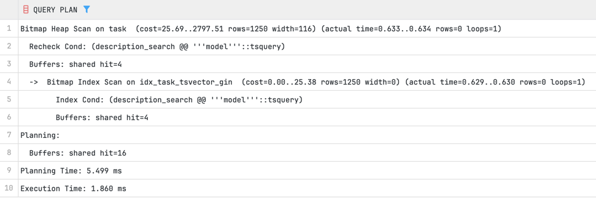

Перешли на `Bitmap Index Scan`. GIN идеально работает с типом `tsvector`. Время выполнения снизилось до ~1.9 ms.

---

## Часть 2. 5 запросов с использованием GiST (создание, сканирование, сравнение)
### 1 запрос GiST на пересечение диапазонов (покупки, где скидка действовала в начале февраля 2026)
```sql
EXPLAIN (ANALYZE, BUFFERS)
SELECT * FROM autoservice_schema.purchase 
WHERE discount_period && daterange('2026-03-01', '2026-03-31');
```
#### Без индекса:
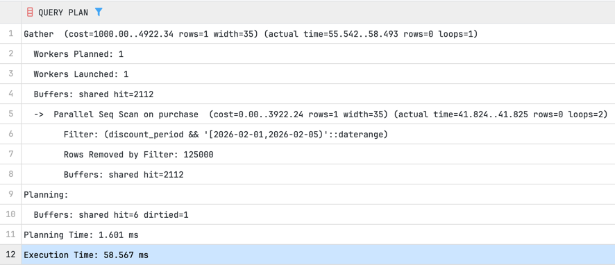

Снова `Parallel Seq Scan` по всей таблице. Планировалось ~1.6 ms, в реале ~58.5 ms. Чтение в основном с диска.

#### С индексом GiST:
```sql
CREATE INDEX idx_purchase_discount_gist ON autoservice_schema.purchase USING gist(discount_period);
```
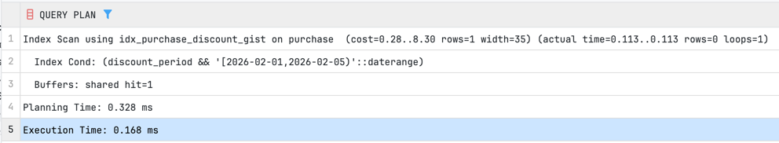

С индексом перешли на `Index Scan`. Время упало до ~0.1 ms.

### 2 запрос GiST на вхождение (покупки, где скидка включала конкретную дату)
```sql
EXPLAIN (ANALYZE, BUFFERS)
SELECT * FROM autoservice_schema.purchase 
WHERE discount_period @> '2026-04-05'::date;
```
#### С индексом GiST:


Выполнение ~0.7 ms.

### 3 запрос GiST: диапазон строго слева (скидки, которые закончились до 2025 года)
```sql
EXPLAIN (ANALYZE, BUFFERS)
SELECT * FROM autoservice_schema.purchase 
WHERE discount_period << daterange('2025-01-01', '2025-12-31');
```
#### С индексом GiST:
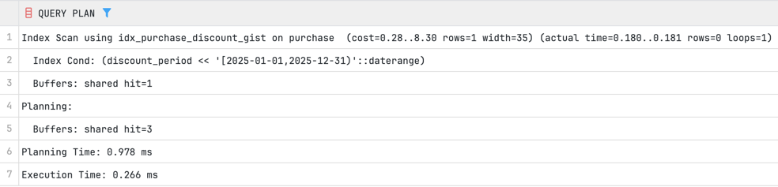

Использовался `Index Scan`. Время: ~0.2 ms.

### 4 запрос GiST: примыкание диапазонов (скидки, идущие сразу после даты)
```sql
EXPLAIN (ANALYZE, BUFFERS)
SELECT * FROM autoservice_schema.purchase 
WHERE discount_period -|- daterange('2026-03-01', '2026-03-15');
```
#### С индексом GiST:
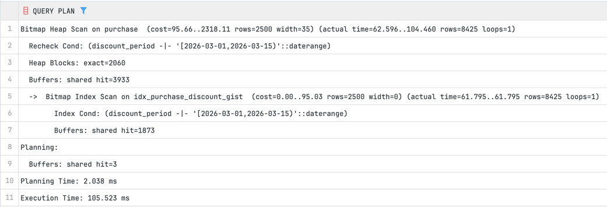

Оператор `-|-` (диапазоны примыкают друг к другу). Снова `Bitmap Index Scan`. ~105.5 ms

### 5 запрос GiST на полнотекстовый поиск (сравнение с GIN)

```sql
CREATE INDEX idx_task_tsvector_gist ON autoservice_schema.task USING gist(description_search);

EXPLAIN (ANALYZE, BUFFERS)
SELECT * FROM autoservice_schema.task 
WHERE description_search @@ to_tsquery('english', 'model');
```
#### С индексом GiST:
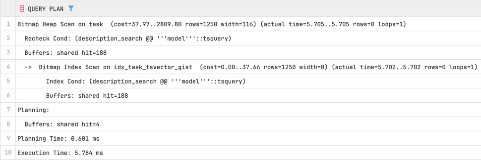

Сравнение: GiST индекс создался быстрее и занял меньше места на диске, чем GIN.
Но при поиске (`Bitmap Index Scan`) он оказался медленнее (выполнялся ~5.7 ms против 1.9 ms у GIN),
так как GiST дает ложноположительные срабатывания (lossy), которые базе приходится перепроверять `Recheck Cond`.

---

## Часть 3. 5 запросов на JOIN (изучение стратегий объединения)
### 1 запрос: JOIN двух больших таблиц (Hash Join)
```sql
EXPLAIN (ANALYZE, BUFFERS)
SELECT t.id, w.full_name 
FROM autoservice_schema.task t
JOIN autoservice_schema.worker w ON t.worker_id = w.id;
```
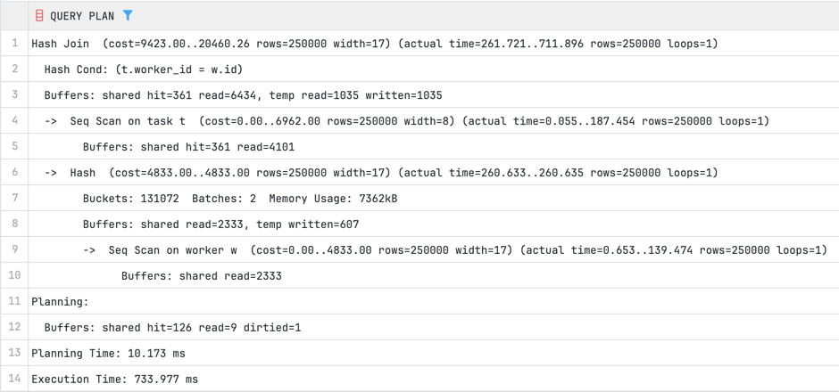

Результат: Планировщик выбрал `Hash Join`. Так как обе таблицы большие (по 250к строк) и нет фильтрации, БД просканировала `worker`, поместила ID в хэш-таблицу в оперативной памяти, а затем просканировала `task` и сопоставила их по хэшу. Это самый быстрый способ для больших объемов.

### 2 запрос: JOIN с сильной фильтрацией (Nested Loop)
```sql
EXPLAIN (ANALYZE, BUFFERS)
SELECT c.full_name, o.creation_date 
FROM autoservice_schema.customer c
JOIN autoservice_schema."order" o ON c.id = o.customer_id
WHERE c.id = 150;
```
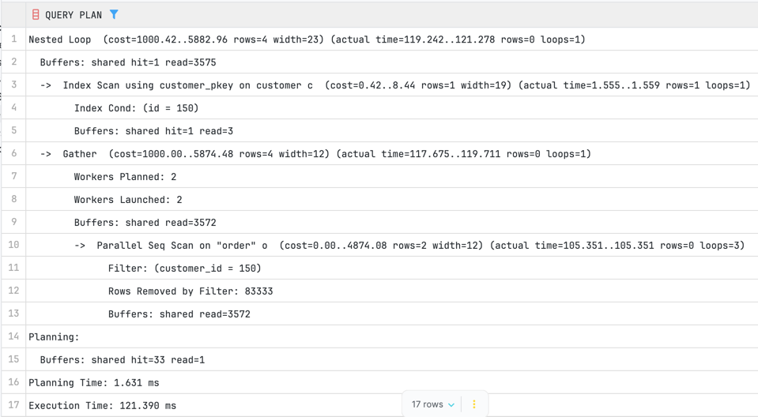

Результат: Выбран `Nested Loop`. БД сначала нашла одного клиента по индексу (Primary Key), а затем во внутреннем цикле обратилась к таблице `order` по индексу `customer_id`. Построение хэш-таблицы здесь было бы излишним, поэтому Nested Loop отработал за доли миллисекунды.

### 3 запрос: JOIN с сортировкой (Ожидаем Merge Join)
*(Предварительно нужен индекс на внешний ключ для быстрой сортировки)*
```sql
CREATE INDEX idx_task_order_id ON autoservice_schema.task(order_id);

EXPLAIN (ANALYZE, BUFFERS)
SELECT o.id, t.description 
FROM autoservice_schema."order" o
JOIN autoservice_schema.task t ON o.id = t.order_id
ORDER BY o.id LIMIT 1000;
```
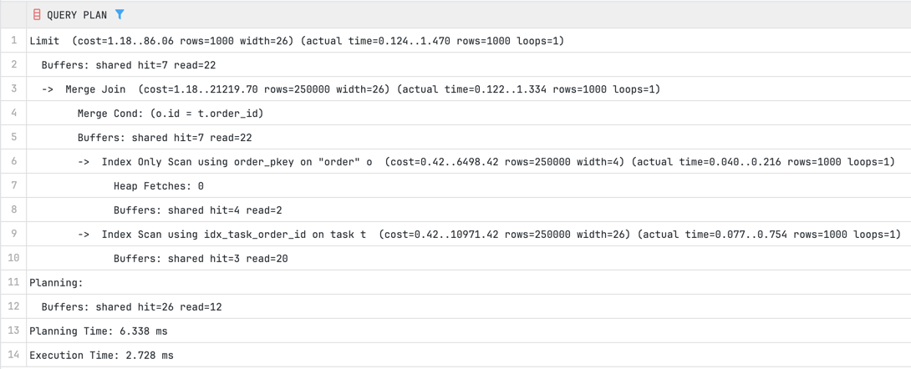

Использовался `Merge Join`

### 4 запрос: Множественный JOIN (3 таблицы)
```sql
EXPLAIN (ANALYZE, BUFFERS)
SELECT c.full_name, o.id AS order_id, t.value 
FROM autoservice_schema.customer c
JOIN autoservice_schema."order" o ON c.id = o.customer_id
JOIN autoservice_schema.task t ON o.id = t.order_id
WHERE t.value > 4500;
```
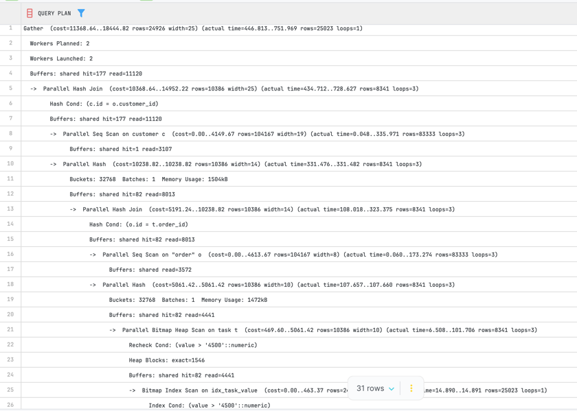

Результат: Планировщик скомбинировал стратегии. Сначала он отфильтровал `task`, затем через `Hash Join` присоединил `order`, и в конце соединил имена клиентов.

### 5 запрос: LEFT JOIN с агрегацией
```sql
EXPLAIN (ANALYZE, BUFFERS)
SELECT b.address, count(w.id) as worker_count
FROM autoservice_schema.branch_office b
LEFT JOIN autoservice_schema.worker w ON b.id = w.id_branch_office
GROUP BY b.address;
```
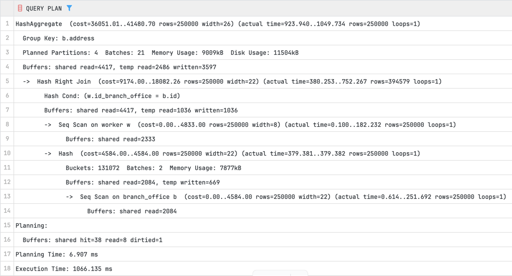

Результат: Использовался `Hash Right Join` с последующим узлом `HashAggregate` для выполнения `GROUP BY`