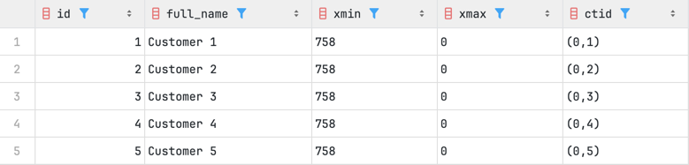
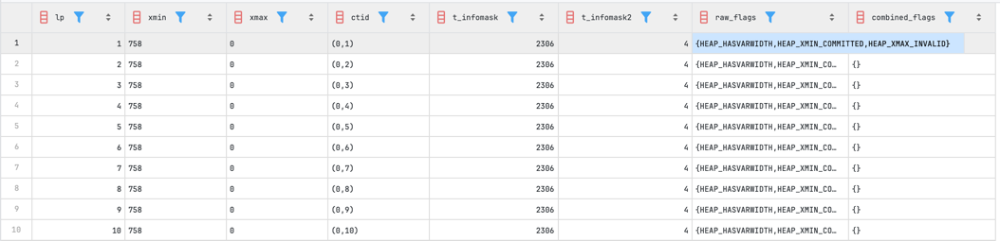
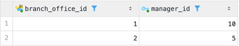
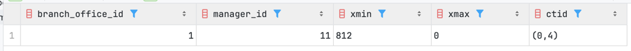
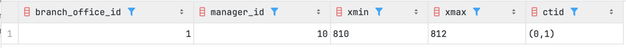
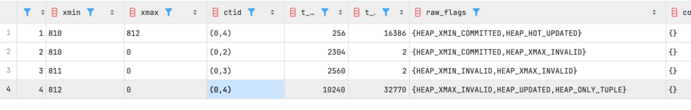
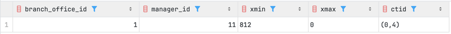
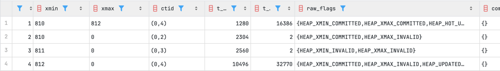
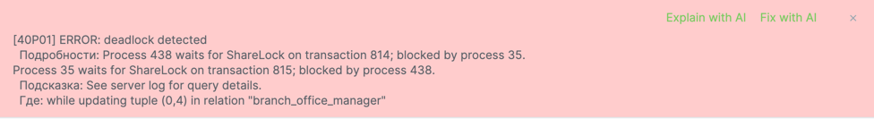
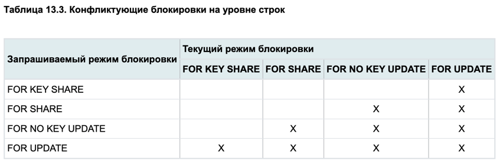

# дз на 11.03.2026

## Часть 1. Смоделировать обновление данных и посмотреть на параметры xmin, xmax, ctid, t_infomask
### pageinspect

Для просмотра метаданных нужно установить расширение.

```sql
CREATE EXTENSION IF NOT EXISTS pageinspect;
```

### смотрим xmin, xmax, ctid
Получить к ним доступ мы могли и без расширения

```sql
SELECT id, full_name, xmin, xmax, ctid
FROM autoservice_schema.customer;
```



### смотрим глубже

В запросе мы берём page 0, разбиваем на кортежи
`CROSS JOIN LATERAL heap_tuple_infomask_flags(h.t_infomask, h.t_infomask2) f`
для каждой строки из h вызывает функцию расшифровки флагов с её текущими значениями t_infomask и t_infomask2
lp - line pointer
```sql
SELECT
    lp,
    t_xmin AS xmin,
    t_xmax AS xmax,
    t_ctid AS ctid,
    t_infomask,
    t_infomask2,
    raw_flags,
    combined_flags
FROM heap_page_items(get_raw_page('mvcc_demo', 0)) h
CROSS JOIN LATERAL heap_tuple_infomask_flags(h.t_infomask, h.t_infomask2) f
ORDER BY lp;
```




## Часть 2. Понять что хранится в t_infomask

Опираясь на предыдущий запрос, t_infomask - это битовый флаг, описывающий различные признаки (метаданные) строки
С помощью функции `heap_tuple_infomask_flags(h.t_infomask, h.t_infomask2)`  мы можем расшифровать эти флаги

## Часть 3. Посмотреть на параметры из п1 в разных транзакциях

Изначально таблица такая



Создаём транзакцию A:
```sql
BEGIN;

UPDATE autoservice_schema.branch_office_manager
SET manager_id = 11
WHERE branch_office_id = 1;

SELECT branch_office_id, manager_id, xmin, xmax, ctid
FROM autoservice_schema.branch_office_manager
WHERE branch_office_id = 1;
```

Коммит не делали



После запускем транзакцию B:
```sql
BEGIN;

SELECT branch_office_id, manager_id, xmin, xmax, ctid
FROM autoservice_schema.branch_office_manager
WHERE branch_office_id = 1;

SELECT
    lp,
    t_xmin AS xmin,
    t_xmax AS xmax,
    t_ctid AS ctid,
    t_infomask,
    t_infomask2,
    raw_flags,
    combined_flags
FROM heap_page_items(get_raw_page('autoservice_schema.branch_office_manager', 0)) h
         CROSS JOIN LATERAL heap_tuple_infomask_flags(h.t_infomask, h.t_infomask2) f
ORDER BY lp;
```
коммит не делаем


Мы видим старое значение, тк транзакция A не закомичена



Тут мы анализируем сами строки из page. Кортеж 1 был изменён транзакцией A, поэтому у него изменился xmax.
Новой версией этой строки стал кортеж 4, исходя из ctid. Кроме того xmin = xmax = 812
На кортеж 3 не надо обращать внимание)


Сделаем коммит A и заново запустим B.



Поменялся manager_id



Заметим, что t_infomask поменялся, а по флагам видно, что xmin_commited


## Часть 4. Смоделировать дедлок, описать результаты

Транзакция A:
```sql
BEGIN;

UPDATE autoservice_schema.branch_office_manager
SET manager_id = 6
WHERE branch_office_id = 1;
```
Берём лок над manager_id у строки 1


Транзакция B:
```sql
BEGIN;

UPDATE autoservice_schema.branch_office_manager
SET manager_id = 12
WHERE branch_office_id = 2;
```
Берём лок над manager_id у строки 2

Транзакция A:
```sql
UPDATE autoservice_schema.branch_office_manager
SET manager_id = 7
WHERE branch_office_id = 2;
```

Здесь постгрес уже завис, тк транзакция B, которая изменяла эту строку ещё не завершилась

Транзакция B:
```sql
UPDATE autoservice_schema.branch_office_manager
SET manager_id = 13
WHERE branch_office_id = 1;
```

Теперь пытаемся изменить ту строку, что держит A.
Вылетает ошибка



## Часть 5. Режимы блокировки на уровне строк
https://postgrespro.ru/docs/postgrespro/current/explicit-locking

Смоделируем ситуацию как в таблице


### FOR KEY SHARE 
Транзакция A:
```sql
BEGIN;
SELECT * FROM autoservice_schema.branch_office_manager WHERE branch_office_id = 1 FOR KEY SHARE;
```
Ставим блокировку `FOR KEY SHARE`

Транзакция B:
```sql
BEGIN;
SELECT * FROM autoservice_schema.branch_office_manager WHERE branch_office_id = 1 FOR KEY SHARE;      -- проходит
SELECT * FROM autoservice_schema.branch_office_manager WHERE branch_office_id = 1 FOR SHARE;          -- проходит
SELECT * FROM autoservice_schema.branch_office_manager WHERE branch_office_id = 1 FOR NO KEY UPDATE;  -- проходит
SELECT * FROM autoservice_schema.branch_office_manager WHERE branch_office_id = 1 FOR UPDATE;         -- ждёт
```

Всё по таблице

Откатим каждую транзакцию `ROLLBACK`

### FOR SHARE
Транзакция A:
```sql
BEGIN;
SELECT * FROM autoservice_schema.branch_office_manager WHERE branch_office_id = 1 FOR SHARE;
```

Транзакция B:
```sql
BEGIN;
SELECT * FROM autoservice_schema.branch_office_manager WHERE branch_office_id = 1 FOR KEY SHARE;      -- проходит
SELECT * FROM autoservice_schema.branch_office_manager WHERE branch_office_id = 1 FOR SHARE;          -- проходит
SELECT * FROM autoservice_schema.branch_office_manager WHERE branch_office_id = 1 FOR NO KEY UPDATE;  -- ждёт
SELECT * FROM autoservice_schema.branch_office_manager WHERE branch_office_id = 1 FOR UPDATE;         -- ждёт
```

### FOR NO KEY UPDATE

Транзакция A:
```sql
BEGIN;
SELECT * FROM autoservice_schema.branch_office_manager WHERE branch_office_id = 1 FOR NO KEY UPDATE;
```

Транзакция B:
```sql
BEGIN;
SELECT * FROM autoservice_schema.branch_office_manager WHERE branch_office_id = 1 FOR KEY SHARE;      -- проходит
SELECT * FROM autoservice_schema.branch_office_manager WHERE branch_office_id = 1 FOR SHARE;          -- ждёт
SELECT * FROM autoservice_schema.branch_office_manager WHERE branch_office_id = 1 FOR NO KEY UPDATE;  -- ждёт
SELECT * FROM autoservice_schema.branch_office_manager WHERE branch_office_id = 1 FOR UPDATE;         -- ждёт
```


### FOR UPDATE

Транзакция A:
```sql
BEGIN;
SELECT * FROM autoservice_schema.branch_office_manager WHERE branch_office_id = 1 FOR UPDATE;
```

Транзакция B:
```sql
BEGIN;
SELECT * FROM autoservice_schema.branch_office_manager WHERE branch_office_id = 1 FOR KEY SHARE;      -- ждёт
SELECT * FROM autoservice_schema.branch_office_manager WHERE branch_office_id = 1 FOR SHARE;          -- ждёт
SELECT * FROM autoservice_schema.branch_office_manager WHERE branch_office_id = 1 FOR NO KEY UPDATE;  -- ждёт
SELECT * FROM autoservice_schema.branch_office_manager WHERE branch_office_id = 1 FOR UPDATE;         -- ждёт
```

Всё точно по таблице 

## Часть 6. Очистка данных

### Обычная очистка:
`VACUUM my_table;`

Обычная очистка с подробным выводом:
`VACUUM (VERBOSE) my_table;`

Очистка плюс обновление статистики:
`VACUUM (ANALYZE) my_table;`

Полная очистка с перепаковкой таблицы:
`VACUUM FULL my_table;`

Агрессивная заморозка старых XID:
`VACUUM (FREEZE) my_table;`

Полная форма с несколькими опциями сразу:
`VACUUM (FULL, FREEZE, VERBOSE, ANALYZE) my_table;`


### Автоочистка
Включить и настроить автоочистку для конкретной таблицы можно так:

```sql
ALTER TABLE my_table SET (
autovacuum_enabled = on,
autovacuum_vacuum_threshold = 10,
autovacuum_vacuum_scale_factor = 0.0,
autovacuum_analyze_threshold = 10,
autovacuum_analyze_scale_factor = 0.0
);
```

Если нужно отключить автоочистку именно для таблицы:

```sql
ALTER TABLE my_table SET (
autovacuum_enabled = off
);
```